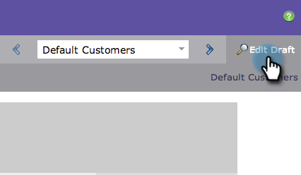

# Prévisualiser une page de destination {#preview-a-landing-page}

Prévisualisez votre page de destination pour voir à quoi elle ressemble avant de la mettre en ligne.

## Prévisualiser une page de destination {#preview-a-landing-page-1}

1. Sélectionnez une page de destination et cliquez sur **[!UICONTROL Aperçu de la page]**.

   

   >[!NOTE]
   >
   >Le brouillon correspond à la version sur laquelle vous travaillez, et non à celle que les clients voient en direct.

1. Vous pouvez également cliquer avec le bouton droit sur votre page de destination et sélectionner **[!UICONTROL Aperçu]**.

   

## Prévisualiser un brouillon de page de destination {#preview-a-landing-page-draft}

1. Cliquez avec le bouton droit sur une page de destination approuvée avec un brouillon et cliquez sur **[!UICONTROL Prévisualiser le brouillon]**.

   

## Prévisualiser un brouillon de page de destination lors de la modification {#preview-a-landing-page-draft-while-editing}

1. Sélectionnez une page de destination et cliquez sur **[!UICONTROL Modifier le brouillon]**.

   

1. À tout moment pendant votre travail dans l’éditeur de page de destination, vous pouvez cliquer sur **[!UICONTROL Prévisualiser le brouillon]**.

   

1. Vous pouvez revenir rapidement à la modification en cliquant sur **[!UICONTROL Modifier le brouillon]**.

   

Vous savez désormais prévisualiser des pages de destination.
