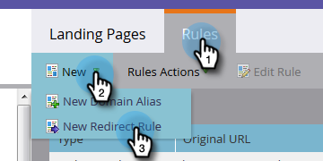

# Rediriger le Landing page du marketing vers une autre page {#redirect-a-marketo-landing-page-to-another-page}

Si vous mettez à jour l’URL d’une page et souhaitez que l’ancienne URL fonctionne toujours, essayez une redirection ! La mettre en place est facile.

>[!NOTE]
>
>**Autorisations d’administrateur requises**

1. Sous **Admin**, cliquez sur **Landings page**.

   

1. Sous l&#39;onglet **Règles**, cliquez sur **Nouveau**, puis sur **Nouvelle règle de redirection**.

   

1. Cliquez sur la première liste déroulante **URL d’origine** et sélectionnez votre Marketo [CNAME](/help/marketo/product-docs/demand-generation/landing-pages/landing-page-actions/customize-your-landing-page-urls-with-a-cname.md).

   

   >[!NOTE]
   >
   >N’oubliez pas que vous ne pouvez rediriger que les URL qui début avec votre Marketo [CNAME](/help/marketo/product-docs/demand-generation/landing-pages/landing-page-actions/customize-your-landing-page-urls-with-a-cname.md).

1. Sélectionnez le landing page à rediriger dans le deuxième champ **URL d’origine**.

   

   >[!NOTE]
   >
   >Vous pouvez entrer n’importe quel chemin d’URL, même si la page ou le répertoire n’existe pas.

1. Cliquez sur la liste déroulante **URL de redirection** et sélectionnez la page vers laquelle vous souhaitez rediriger les visiteurs.

   

1. Cliquez sur **Créer**.

   

   >[!TIP]
   >
   >Pour rediriger vers une page Web en dehors de Marketo, cliquez sur **Utiliser un Landing page autre que Marketo**.

   >[!MORELIKETHIS]
   >
   >[Redirection d’un chemin d’URL](/help/marketo/product-docs/demand-generation/landing-pages/personalizing-landing-pages/redirect-a-url-path.md)
