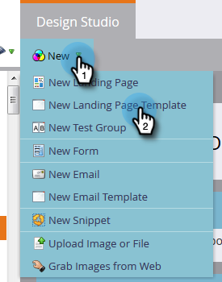

# Création d’un modèle de page d’entrée de forme libre {#create-a-free-form-landing-page-template}

Les landing pages sans forme nécessitent moins de connaissances techniques que leurs homologues guidés. Pour créer un modèle pour les futures landing pages, procédez comme suit.

1. Accédez à **Design Studio**.

   

1. Cliquez sur **Nouveau**, puis sélectionnez **Nouveau modèle de page d’entrée**.

   

1. Choisissez votre dossier, puis attribuez un nom à votre modèle. Free-form est le mode de modification par défaut. Après avoir nommé votre modèle, cliquez sur **Créer**.

   

1. Votre modèle doit s’ouvrir dans un nouvel onglet. Il est désormais modifiable pour toute personne familière avec CSS/HTML.

   

   >[!NOTE]
   >
   >La prise en charge de Marketo n’est pas configurée pour vous aider à résoudre les problèmes liés à l’HTML personnalisé. Pour obtenir de l’aide sur les HTMLS, consultez un développeur web.

1. Lorsque vous avez terminé d’apporter des modifications, cliquez sur **Actions sur les modèles**, puis sélectionnez **Approuver et fermer**.

   

   Vous disposez désormais d’un nouveau modèle de landing page de forme libre !

   >[!NOTE]
   >
   >Sélectionnez **Désactiver le suivi Munchkin** si vous souhaitez empêcher le préremplissage des formulaires ou si vous ne souhaitez pas suivre le comportement web sur une page spécifique.\
   >Sélectionnez **Valider la compatibilité mobile** pour vous assurer que votre code est compatible avec les appareils mobiles.

   >[!MORELIKETHIS]
   >
   >* [Créer une page d’entrée de forme libre](/help/marketo/product-docs/demand-generation/landing-pages/free-form-landing-pages/create-a-free-form-landing-page.md)
   >* [Créer un modèle de page d’entrée guidée](/help/marketo/product-docs/demand-generation/landing-pages/landing-page-templates/create-a-guided-landing-page-template.md)
   >* [Comprendre les pages d’entrée libres ou guidées](/help/marketo/product-docs/demand-generation/landing-pages/understanding-landing-pages/understanding-free-form-vs-guided-landing-pages.md)
