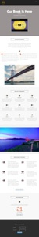
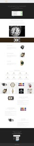

# Liste de modèles de page d’entrée guidée {#guided-landing-page-template-list}

Parcourez notre collection d’exemples de modèles à utiliser avec le [Éditeur de page d’entrée guidé](/help/marketo/product-docs/demand-generation/landing-pages/guided-landing-pages/create-a-guided-landing-page.md). Chaque modèle est entièrement réactif et basé sur la structure du Bootstrap.

>[!NOTE]
>
>La prise en charge de Marketo n’est pas configurée pour faciliter le HTML de dépannage. Si vous avez besoin d’aide pour modifier l’un de ces modèles, consultez un développeur web.

Pour importer un modèle dans Marketo :

1. Cliquez sur le nom du modèle pour une vue plus grande.
1. Téléchargez le modèle sélectionné.
1. Dans Marketo, accédez au **Design Studio.**
1. Cliquez sur **Pages d’entrée** dans l’arborescence de gauche, puis sélectionnez **Modèles.**

1. Dans la barre de menus, cliquez sur **Modèle d’importation.**
1. Sélectionnez le fichier téléchargé, saisissez un nom de modèle, puis cliquez sur **Importer** (veillez à sélectionner un nom explicite et à indiquer que le mode de modification est **Guidée**).

|  |  |  |
|---|---|---|
| [Modèle 1A](guided-landing-page-templates/template-1a.md) | [Modèle 1B](guided-landing-page-templates/template-1b.md) | [Modèle 1C](guided-landing-page-templates/template-1c.md) |
|  |  |  |
| [Modèle 1D](guided-landing-page-templates/template-1d.md) | [Modèle 1E](guided-landing-page-templates/template-1e.md) | [Modèle 1F](guided-landing-page-templates/template-1f.md) |
|  |  |  |
| [Modèle 2A](guided-landing-page-templates/template-2a.md) | [Modèle 2B](guided-landing-page-templates/template-2b.md) | [Modèle 2C](guided-landing-page-templates/template-2c.md) |
|  |  |  |
| [Modèle 2D](guided-landing-page-templates/template-2d.md) | [Modèle 3A](guided-landing-page-templates/template-3a.md) | [Modèle 3B](guided-landing-page-templates/template-3b.md) |
|  |  |  |
| [Modèle 3C](guided-landing-page-templates/template-3c.md) | [Modèle 3D](guided-landing-page-templates/template-3d.md) | [Modèle 4A](guided-landing-page-templates/template-4a.md) |
|  |  |  |
| [Modèle 4B](guided-landing-page-templates/template-4b.md) | [Modèle 4C](guided-landing-page-templates/template-4c.md) | [Modèle 5A](guided-landing-page-templates/template-5a.md) |
|  |  |  |
| [Modèle 5B](guided-landing-page-templates/template-5b.md) | [Modèle 5C](guided-landing-page-templates/template-5c.md) | [Modèle 5D](guided-landing-page-templates/template-5d.md) |
|  |  |  |
| [Template 5E](guided-landing-page-templates/template-5e.md) | [Modèle 6A](guided-landing-page-templates/template-6a.md) | [Modèle 6B](guided-landing-page-templates/template-6b.md) |
|  |  |  |
| [Modèle 6C](guided-landing-page-templates/template-6c.md) | [Modèle 6D](guided-landing-page-templates/template-6d.md) | [Modèle 6E](guided-landing-page-templates/template-6e.md) |
|  |  |  |
| [Modèle 7A](guided-landing-page-templates/template-7a.md) | [Modèle 7B](guided-landing-page-templates/template-7b.md) | [Modèle 7C](guided-landing-page-templates/template-7c.md) |
|  |  |  |
| [Modèle 7D](guided-landing-page-templates/template-7d.md) | [Modèle 7E](guided-landing-page-templates/template-7e.md) | [Modèle 7F](guided-landing-page-templates/template-7f.md) |
|  |  |  |
| [Modèle 8A](guided-landing-page-templates/template-8a.md) | [Modèle 8B](guided-landing-page-templates/template-8b.md) | [Modèle 8C](guided-landing-page-templates/template-8c.md) |
|  |  |  |
| [Modèle 8D](guided-landing-page-templates/template-8d.md) | [Modèle 8E](guided-landing-page-templates/template-8e.md) | [Modèle 8F](guided-landing-page-templates/template-8f.md) |
|  |  |  |
| [Modèle 8G](guided-landing-page-templates/template-8g.md) | [Modèle 9A](guided-landing-page-templates/template-9a.md) | [Modèle 9B](guided-landing-page-templates/template-9b.md) |
|  |  |  |
| [Modèle 9C](guided-landing-page-templates/template-9c.md) | [Modèle 9D](guided-landing-page-templates/template-9d.md) | [Modèle 9E](guided-landing-page-templates/template-9e.md) |
|  |  |  |
| [Modèle 9F](guided-landing-page-templates/template-9f.md) | [Modèle 10A](guided-landing-page-templates/template-10a.md) | [Modèle 10B](guided-landing-page-templates/template-10b.md) |
|  |  |  |
| [Modèle 10C](guided-landing-page-templates/template-10c.md) | [Modèle 10D](guided-landing-page-templates/template-10d.md) | [Modèle 10E](guided-landing-page-templates/template-10e.md) |
|  |  |  |
| [Modèle 10F](guided-landing-page-templates/template-10f.md) | [Modèle 11A](guided-landing-page-templates/template-11a.md) | [Modèle 11B](guided-landing-page-templates/template-11b.md) |
|  |  |  |
| [Modèle 11C](guided-landing-page-templates/template-11c.md) | [Modèle 11D](guided-landing-page-templates/template-11d.md) | [Modèle 11E](guided-landing-page-templates/template-11e.md) |
|  |  |  |
| [Modèle 11F](guided-landing-page-templates/template-11f.md) | [Modèle 12A](guided-landing-page-templates/template-12a.md) | [Modèle 12B](guided-landing-page-templates/template-12b.md) |
|  |  |  |
| [Modèle 12C](guided-landing-page-templates/template-12c.md) | [Modèle 12D](guided-landing-page-templates/template-12d.md) | [Modèle 12E](guided-landing-page-templates/template-12e.md) |
|  |  |  |
| [Modèle 12F](guided-landing-page-templates/template-12f.md) | [Modèle 13A](guided-landing-page-templates/template-13a.md) | [Modèle 13B](guided-landing-page-templates/template-13b.md) |
|  |  |  |
| [Modèle 13C](guided-landing-page-templates/template-13c.md) | [Modèle 13D](guided-landing-page-templates/template-13d.md) | [Modèle 13E](guided-landing-page-templates/template-13e.md) |
|  |  |  |
| [Modèle 14A](guided-landing-page-templates/template-14a.md) | [Modèle 14B](guided-landing-page-templates/template-14b.md) | [Modèle 14C](guided-landing-page-templates/template-14c.md) |
|  |  |  |
| [Modèle 14D](guided-landing-page-templates/template-14d.md) | [Modèle 14E](guided-landing-page-templates/template-14e.md) | [Modèle 15A](guided-landing-page-templates/template-15a.md) |
|  |  |  |
| [Modèle 15B](guided-landing-page-templates/template-15b.md) | [Modèle 15C](guided-landing-page-templates/template-15c.md) | [Modèle 15D](guided-landing-page-templates/template-15d.md) |
|  |  |  |
| [Modèle 15E](guided-landing-page-templates/template-15e.md) | [Modèle 16A](guided-landing-page-templates/template-16a.md) | [Modèle 16B](guided-landing-page-templates/template-16b.md) |
|  |  |  |
| [Modèle 16C](guided-landing-page-templates/template-16c.md) | [Modèle 16D](guided-landing-page-templates/template-16d.md) | [Modèle 16E](guided-landing-page-templates/template-16e.md) |
|  |  |  |
| [Modèle 17A](guided-landing-page-templates/template-17a.md) | [Modèle 17B](guided-landing-page-templates/template-17b.md) | [Modèle 17C](guided-landing-page-templates/template-17c.md) |
|  |  |  |
| [Modèle 17D](guided-landing-page-templates/template-17d.md) | [Modèle 17E](guided-landing-page-templates/template-17e.md) | [Modèle 18A](guided-landing-page-templates/template-18a.md) |
|  |  |  |
| [Modèle 18B](guided-landing-page-templates/template-18b.md) | [Modèle 18C](guided-landing-page-templates/template-18c.md) | [Modèle 18D](guided-landing-page-templates/template-18d.md) |
|  |  |  |
| [Modèle 18E](guided-landing-page-templates/template-18e.md) | [Modèle 19A](guided-landing-page-templates/template-19a.md) | [Modèle 19B](guided-landing-page-templates/template-19b.md) |
|  |  |  |
| [Modèle 19C](guided-landing-page-templates/template-19c.md) | [Modèle 19D](guided-landing-page-templates/template-19d.md) | [Modèle 19E](guided-landing-page-templates/template-19e.md) |
|  |  |  |
| [Modèle 20A](guided-landing-page-templates/template-20a.md) | [Modèle 20B](guided-landing-page-templates/template-20b.md) | [Modèle 20C](guided-landing-page-templates/template-20c.md) |
|  |  |  |
| [Modèle 20D](guided-landing-page-templates/template-20d.md) | [Modèle 20E](guided-landing-page-templates/template-20e.md) |  |
|  |  |  |
