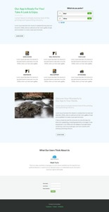
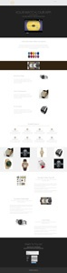

# Modèles de Landing page guidé {#guided-landing-page-templates}

Parcourez notre collection d’exemples de modèles, à utiliser avec l’éditeur [de Landing page](../../../../product-docs/demand-generation/landing-pages/guided-landing-pages/create-a-guided-landing-page.md)guidé. Chaque modèle est entièrement réactif et basé sur la structure du Bootstrap.

>[!NOTE]
>
>La prise en charge du marketing n’est pas configurée pour faciliter le dépannage du code HTML. Si vous avez besoin d&#39;aide pour modifier l&#39;un de ces modèles, veuillez consulter un développeur Web.

Pour importer un modèle dans Marketo :

1. Cliquez sur le nom du modèle pour une vue plus grande.
1. Téléchargez le modèle choisi.
1. Dans Marketo, accédez à **Design Studio.**
1. Cliquez sur **Landings page** dans l’arborescence de gauche, puis sélectionnez **Modèles.**

1. Dans la barre de menus, cliquez sur **Modèle d&#39;import.**
1. Choisissez le fichier téléchargé, saisissez un nom de modèle, puis cliquez sur **Importer** (assurez-vous de sélectionner un nom descriptif et d’indiquer que le mode de modification est **Guided**).

|  |  |  |
|---|---|---|
| [Modèle 1-A](guided-landing-page-templates/template-1-a.md) | [Modèle 1-B](guided-landing-page-templates/template-1-b.md) | [Modèle 1-C](guided-landing-page-templates/template-1-c.md) |
|  |  |  |
| [Modèle 1-D](guided-landing-page-templates/template-1-d.md) | [Modèle 1-E](guided-landing-page-templates/template-1-e.md) | [Modèle 1-F](guided-landing-page-templates/template-1-f.md) |
|  |  |  |
| [Modèle 2-A](guided-landing-page-templates/template-2-a.md) | [Modèle 2-B](guided-landing-page-templates/template-2-b.md) | [Modèle 2-C](guided-landing-page-templates/template-2-c.md) |
|  |  |  |
| [Modèle 2-D](guided-landing-page-templates/template-2-d.md) | [Modèle 3-A](guided-landing-page-templates/template-3-a.md) | [Modèle 3-B](guided-landing-page-templates/template-3-b.md) |
|  |  |  |
| [Modèle 3-C](guided-landing-page-templates/template-3-c.md) | [Modèle 3-D](guided-landing-page-templates/template-3-d.md) | [Modèle 4-A](guided-landing-page-templates/template-4-a.md) |
|  |  |  |
| [Modèle 4-B](guided-landing-page-templates/template-4-b.md) | [Modèle 4-C](guided-landing-page-templates/template-4-c.md) | [Modèle 5-A](guided-landing-page-templates/template-5-a.md) |
|  |  |  |
| [Modèle 5-B](guided-landing-page-templates/template-5-b.md) | [Modèle 5-C](guided-landing-page-templates/template-5-c.md) | [Modèle 5-D](guided-landing-page-templates/template-5-d.md) |
|  |  |  |
| [Modèle 5-E](guided-landing-page-templates/template-5-e.md) | [Modèle 6-A](guided-landing-page-templates/template-6-a.md) | [Modèle 6-B](guided-landing-page-templates/template-6-b.md) |
|  |  |  |
| [Modèle 6-C](guided-landing-page-templates/template-6-c.md) | [Modèle 6-D](guided-landing-page-templates/template-6-d.md) | [Modèle 6-E](guided-landing-page-templates/template-6-e.md) |
|  |  |  |
| [Modèle 7-A](guided-landing-page-templates/template-7-a.md) | [Modèle 7-B](guided-landing-page-templates/template-7-b.md) | [Modèle 7-C](guided-landing-page-templates/template-7-c.md) |
|  |  |  |
| [Modèle 7-D](guided-landing-page-templates/template-7-d.md) | [Modèle 7-E](guided-landing-page-templates/template-7-e.md) | [Modèle 7-F](guided-landing-page-templates/template-7-f.md) |
|  |  |  |
| [Modèle 8-A](guided-landing-page-templates/template-8-a.md) | [Modèle 8-B](guided-landing-page-templates/template-8-b.md) | [Modèle 8-C](guided-landing-page-templates/template-8-c.md) |
|  |  |  |
| [Modèle 8-D](guided-landing-page-templates/template-8-d.md) | [Modèle 8-E](guided-landing-page-templates/template-8-e.md) | [Modèle 8-F](guided-landing-page-templates/template-8-f.md) |
|  |  |  |
| [Modèle 8-G](guided-landing-page-templates/template-8-g.md) | [Modèle 9-A](guided-landing-page-templates/template-9-a.md) | [Modèle 9-B](guided-landing-page-templates/template-9-b.md) |
|  |  |  |
| [Modèle 9-C](guided-landing-page-templates/template-9-c.md) | [Modèle 9-D](guided-landing-page-templates/template-9-d.md) | [Modèle 9-E](guided-landing-page-templates/template-9-e.md) |
|  |  |  |
| [Modèle 9-F](guided-landing-page-templates/template-9-f.md) | [Modèle 10-A](guided-landing-page-templates/template-10-a.md) | [Modèle 10-B](guided-landing-page-templates/template-10-b.md) |
|  |  |  |
| [Modèle 10-C](guided-landing-page-templates/template-10-c.md) | [Modèle 10-D](guided-landing-page-templates/template-10-d.md) | [Modèle 10-E](guided-landing-page-templates/template-10-e.md) |
|  |  |  |
| [Modèle 10-F](guided-landing-page-templates/template-10-f.md) | [Modèle 11-A](guided-landing-page-templates/template-11-a.md) | [Modèle 11-B](guided-landing-page-templates/template-11-b.md) |
|  |  |  |
| [Modèle 11-C](guided-landing-page-templates/template-11-c.md) | [Modèle 11-D](guided-landing-page-templates/template-11-d.md) | [Modèle 11-E](guided-landing-page-templates/template-11-e.md) |
|  |  |  |
| [Modèle 11-F](guided-landing-page-templates/template-11-f.md) | [Modèle 12-A](guided-landing-page-templates/template-12-a.md) | [Modèle 12-B](guided-landing-page-templates/template-12-b.md) |
|  |  |  |
| [Modèle 12-C](guided-landing-page-templates/template-12-c.md) | [Modèle 12-D](guided-landing-page-templates/template-12-d.md) | [Modèle 12-E](guided-landing-page-templates/template-12-e.md) |
|  |  |  |
| [Modèle 12-F](guided-landing-page-templates/template-12-f.md) | [Modèle 13-C](guided-landing-page-templates/template-13-a.md) | [Modèle 13-B](guided-landing-page-templates/template-13-b.md) |
|  |  |  |
| [Modèle 13-C](guided-landing-page-templates/template-13-c.md) | [Modèle 13-D](guided-landing-page-templates/template-13-d.md) | [Modèle 13-E](guided-landing-page-templates/template-13-e.md) |
|  |  |  |
| [Modèle 14-A](guided-landing-page-templates/template-14-a.md) | [Modèle 14-B](guided-landing-page-templates/template-14-b.md) | [Modèle 14-C](guided-landing-page-templates/template-14-c.md) |
|  |  |  |
| [Modèle 14-D](guided-landing-page-templates/template-14-d.md) | [Modèle 14-E](guided-landing-page-templates/template-14-e.md) | [Modèle 15-A](guided-landing-page-templates/template-15-a.md) |
|  |  |  |
| [Modèle 15-B](guided-landing-page-templates/template-15-b.md) | [Modèle 15-C](guided-landing-page-templates/template-15-c.md) | [Modèle 15-D](guided-landing-page-templates/template-15-d.md) |
|  |  |  |
| [Modèle 15-E](guided-landing-page-templates/template-15-e.md) | [Modèle 16-A](guided-landing-page-templates/template-16-a.md) | [Modèle 16-B](guided-landing-page-templates/template-16-b.md) |
|  |  |  |
| [Modèle 16-C](guided-landing-page-templates/template-16-c.md) | [Modèle 16-D](guided-landing-page-templates/template-16-d.md) | [Modèle 16-E](guided-landing-page-templates/template-16-e.md) |
|  |  |  |
| [Modèle 17-A](guided-landing-page-templates/template-17-a.md) | [Modèle 17-B](guided-landing-page-templates/template-17-b.md) | [Modèle 17-C](guided-landing-page-templates/template-17-c.md) |
|  |  |  |
| [Modèle 17-D](guided-landing-page-templates/template-17-d.md) | [Modèle 17-E](guided-landing-page-templates/template-17-e.md) | [Modèle 18-A](guided-landing-page-templates/template-18-a.md) |
|  |  |  |
| [Modèle 18-B](guided-landing-page-templates/template-18-b.md) | [Modèle 18-C](guided-landing-page-templates/template-18-c.md) | [Modèle 18-D](guided-landing-page-templates/template-18-d.md) |
|  |  |  |
| [Modèle 18-E](guided-landing-page-templates/template-18-e.md) | [Modèle 19-A](guided-landing-page-templates/template-19-a.md) | [Modèle 19-B](guided-landing-page-templates/template-19-b.md) |
|  |  |  |
| [Modèle 19-C](guided-landing-page-templates/template-19-c.md) | [Modèle 19-D](guided-landing-page-templates/template-19-d.md) | [Modèle 19-E](guided-landing-page-templates/template-19-e.md) |
|  |  |  |
| [Modèle 20-A](guided-landing-page-templates/template-20-a.md) | [Modèle 20-B](guided-landing-page-templates/template-20-b.md) | [Modèle 20-C](guided-landing-page-templates/template-20-c.md) |
|  |  |  |
| [Modèle 20-D](guided-landing-page-templates/template-20-d.md) | [Modèle 20-E](guided-landing-page-templates/template-20-e.md) |  |
|  |  |  |
