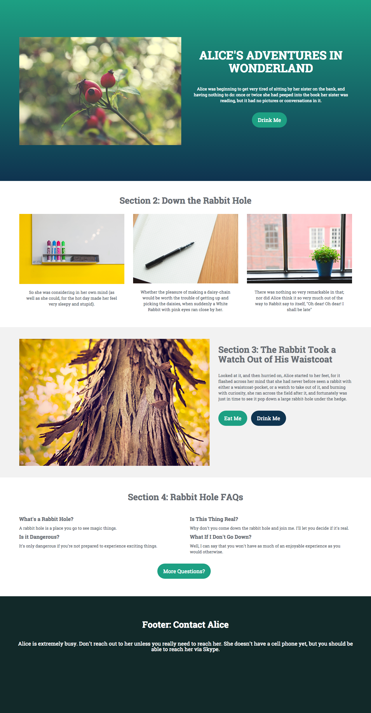

# Modèle 1-A {#template-a}

Cliquez avec le bouton droit pour [Télécharger le modèle 1-A](https://docs.marketo.com/download/attachments/7515620/Template1-A.html?version=3&amp;modificationDate=1432834576000&amp;api=v2).

Ce modèle comprend le contenu suivant :

* Une section Principale

   * inclut une image à forte identification, un en-tête, un corps de texte et un bouton.

* Trois sections de contenu (facultatif)
* Pied de page (facultatif)

**Cliquez avec le bouton droit ci-dessous pour télécharger ce modèle :**

[Template1-A.html](https://docs.marketo.com/download/attachments/7515620/Template1-A.html?version=3&amp;modificationDate=1432834576000&amp;api=v2)
