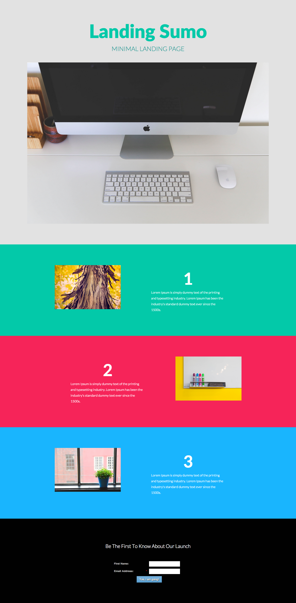

# Modèle 10B {#template-10b}

Cliquez avec le bouton droit pour [télécharger le modèle 10B](https://experienceleague.adobe.com/landing/marketo/lp-templates/template-10b.html)

Ce modèle comprend le contenu suivant :

* Une section principale

   * Inclut un en-tête de héros, un texte de héros et une image de héros

* Trois sections de corps (facultatif)
* Un pied de page (facultatif)

**Cliquez avec le bouton droit de la souris ci-dessous pour télécharger ce modèle :**

[Modèle 10B.html](https://experienceleague.adobe.com/landing/marketo/lp-templates/template-10b.html)
