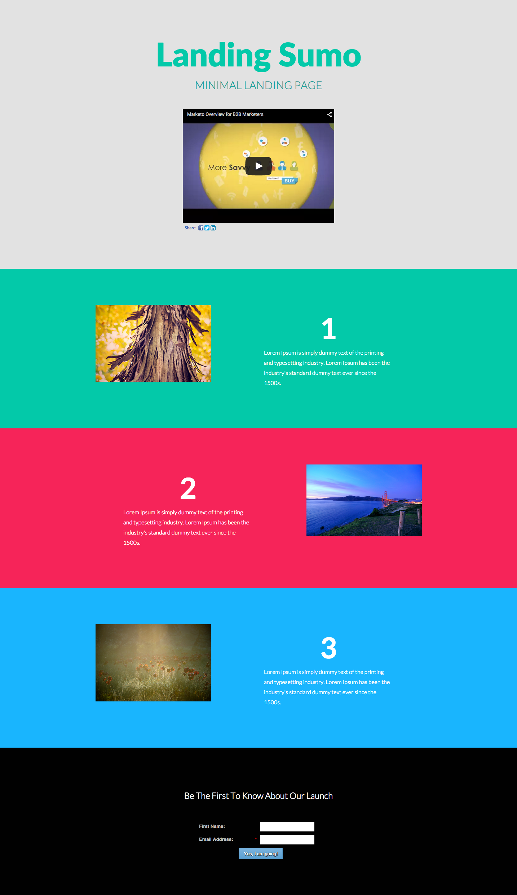

# Modèle 10C {#template-10c}

Cliquez avec le bouton droit [télécharger le modèle 10C](https://51837-micrositemarketo.adobeio-static.net/lp-templates/template-10c.html) et sélectionnez **Enregistrer le lien sous...**

>[!NOTE]
>
>Les étapes complètes de téléchargement et d’importation d’un modèle [sont disponibles ici](/help/marketo/product-docs/demand-generation/landing-pages/landing-page-templates/guided-landing-page-template-list.md#how-to-import){target="_blank"}.

Ce modèle comprend le contenu suivant :

* Une section principale

  * comprend un en-tête de héros, du texte de héros et une vidéo de héros

* Trois sections de corps (facultatif)
* Un pied de page (facultatif)

**Cliquez avec le bouton droit ci-dessous (et sélectionnez _Enregistrer le lien sous..._) pour télécharger ce modèle, procédez comme suit**

[Modèle 10C.html](https://51837-micrositemarketo.adobeio-static.net/lp-templates/template-10c.html)
