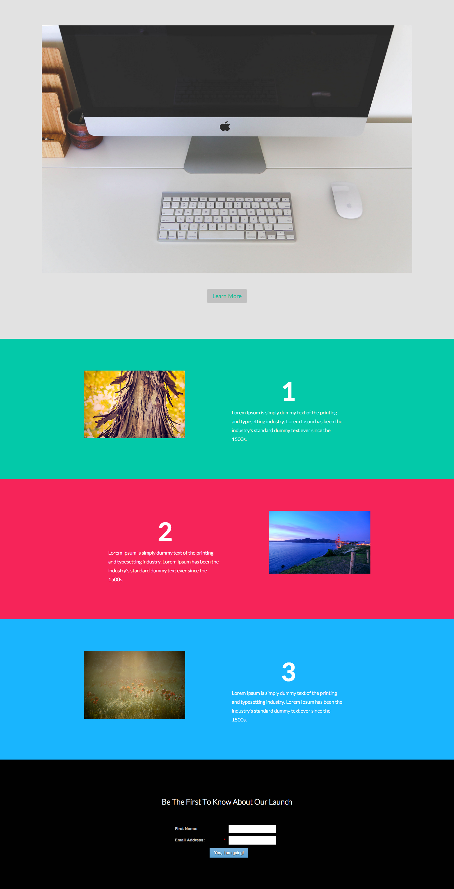

# Modèle 10F {#template-10f}

Cliquez avec le bouton droit pour [télécharger le modèle 10F](https://51837-micrositemarketo.adobeio-static.net/lp-templates/template-10f.html)

Ce modèle comprend le contenu suivant :

* Une section principale

  * comprend une image principale et un bouton

* Trois sections de corps (facultatif)
* Un pied de page (facultatif)

**Cliquez avec le bouton droit de la souris ci-dessous pour télécharger ce modèle :**

[Modèle 10F.html](https://51837-micrositemarketo.adobeio-static.net/lp-templates/template-10f.html)
