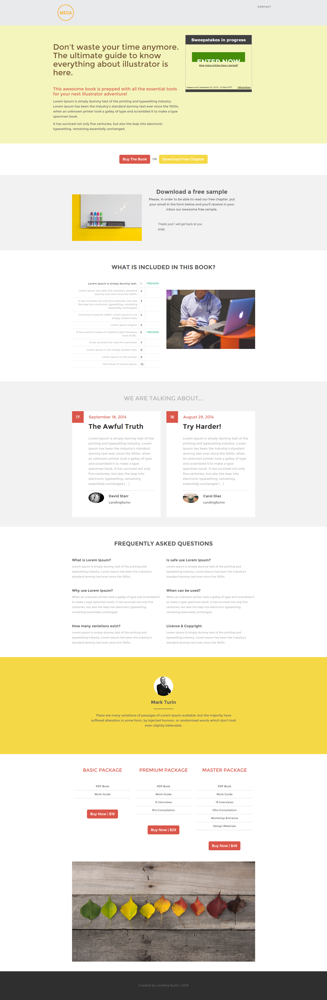

# Modèle 12E {#template-12e}

Cliquez avec le bouton droit pour [télécharger le modèle 12E](https://51837-micrositemarketo.adobeio-static.net/lp-templates/template-12e.html)

Ce modèle comprend le contenu suivant :

* En-tête (facultatif)
* Une section principale

  * inclut un titre de héros, un texte de héros et un tirage au sort

* Six sections de corps (facultatif)
* Pied de page (facultatif)

**Cliquez avec le bouton droit de la souris ci-dessous pour télécharger ce modèle :**

[Modèle 12E.html](https://51837-micrositemarketo.adobeio-static.net/lp-templates/template-12e.html)
