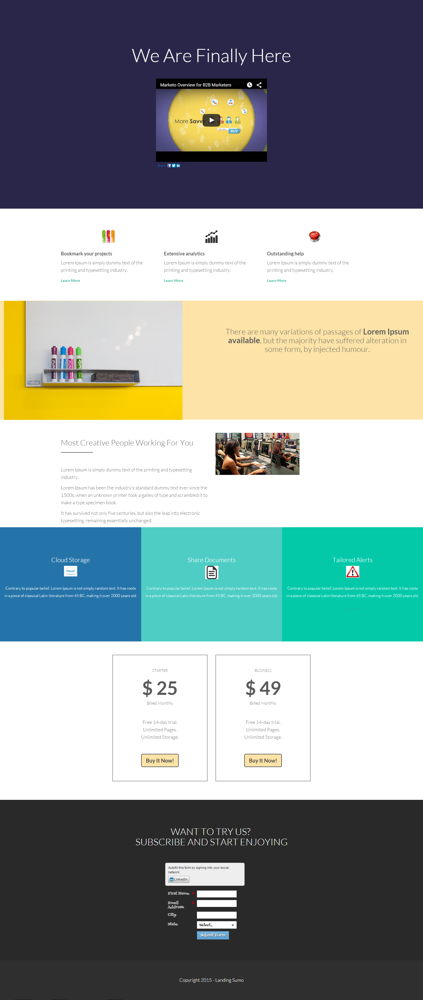

# Modèle 13B {#template-13b}

Cliquez avec le bouton droit pour [télécharger le modèle 13B](https://51837-micrositemarketo.adobeio-static.net/lp-templates/template-13b.html)

Ce modèle comprend le contenu suivant :

* Une section principale

  * inclut le titre de héros et la vidéo de héros

* Cinq sections de corps (facultatif)
* Pied de page (facultatif)

**Cliquez avec le bouton droit de la souris ci-dessous pour télécharger ce modèle :**

[Modèle 13B.html](https://51837-micrositemarketo.adobeio-static.net/lp-templates/template-13b.html)
