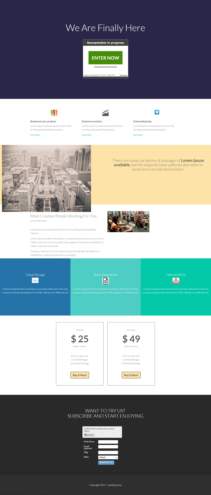

# Modèle 13D {#template-13d}

Cliquez avec le bouton droit pour [télécharger le modèle 13D](https://experienceleague.adobe.com/landing/marketo/lp-templates/template-13d.html)

Ce modèle comprend le contenu suivant :

* Une section principale

   * inclut le titre de héros et les tirages au sort

* Cinq sections de corps (facultatif)
* Pied de page (facultatif)

**Cliquez avec le bouton droit de la souris ci-dessous pour télécharger ce modèle :**

[Modèle 13D.html](https://experienceleague.adobe.com/landing/marketo/lp-templates/template-13d.html)
