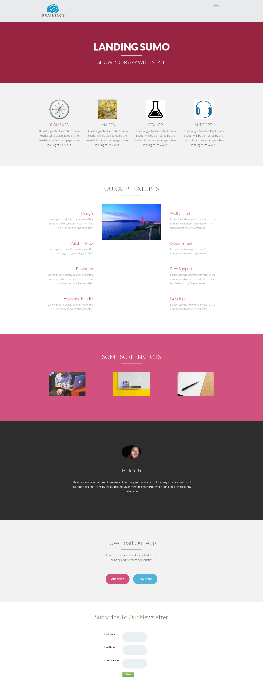

# Modèle 14A {#template-14a}

Cliquez avec le bouton droit pour [télécharger le modèle 14A](https://51837-micrositemarketo.adobeio-static.net/lp-templates/template-14a.html)

Ce modèle comprend le contenu suivant :

* En-tête (facultatif)
* Une section principale

  * Inclut le titre et le texte du héros

* Cinq sections de corps (facultatif)
* Pied de page (facultatif)

**Cliquez avec le bouton droit de la souris ci-dessous pour télécharger ce modèle :**

[Modèle 14A.html](https://51837-micrositemarketo.adobeio-static.net/lp-templates/template-14a.html)
