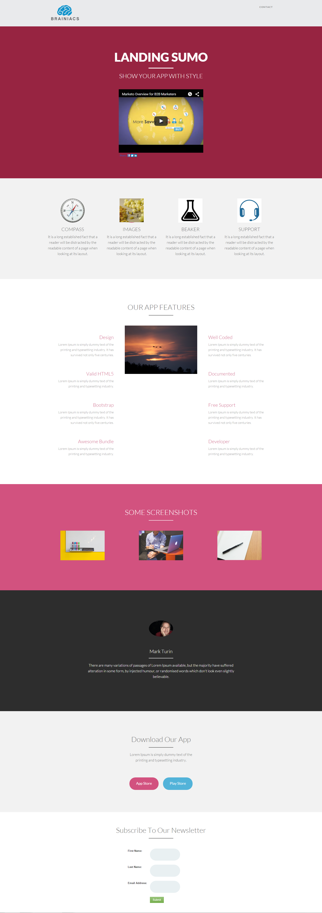

# Modèle 14B {#template-14b}

Cliquez avec le bouton droit pour [télécharger le modèle 14B](https://experienceleague.adobe.com/landing/marketo/lp-templates/template-14b.html)

Ce modèle comprend le contenu suivant :

* En-tête (facultatif)
* Une section principale

   * inclut le titre, le texte et la vidéo du héros

* Cinq sections de corps (facultatif)
* Pied de page (facultatif)

**Cliquez avec le bouton droit de la souris ci-dessous pour télécharger ce modèle :**

[Modèle 14B.html](https://experienceleague.adobe.com/landing/marketo/lp-templates/template-14b.html)
