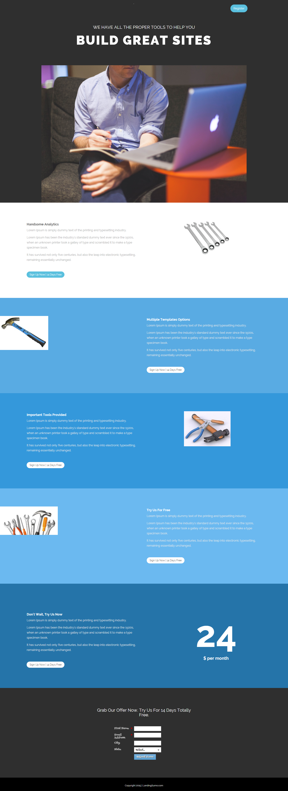

# Modèle 15-A {#template-a}

[Télécharger le modèle 15-A](https://docs.marketo.com/download/attachments/9437816/template-15a.html?version=1&amp;modificationdate=1438980388000&amp;api=v2)

Ce modèle comprend le contenu suivant :

* Une section Principale

   * inclut le titre de héros et l’image de héros

* Cinq sections de contenu (facultatif)
* Pied de page (facultatif)

**Cliquez ci-dessous pour télécharger ce modèle :**

[Template15-A.html](https://docs.marketo.com/download/attachments/9437816/template-15a.html?version=1&amp;modificationdate=1438980388000&amp;api=v2)
