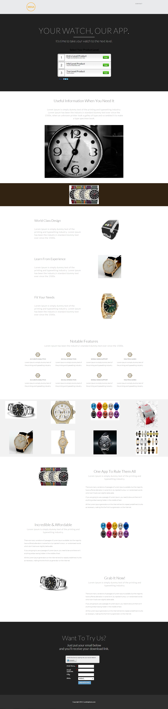

# Modèle 16-C {#template-c}

[Télécharger le modèle 16-C](https://docs.marketo.com/download/attachments/9437840/template-16c.html?version=1&amp;modificationdate=1438980731000&amp;api=v2)

Ce modèle comprend le contenu suivant :

* En-tête (facultatif)
* Une section Principale

   * inclut le titre et le questionnaire du héros

* Six sections de contenu (facultatif)
* Pied de page (facultatif)

**Cliquez ci-dessous pour télécharger ce modèle :**

[Template16-C.html](https://docs.marketo.com/download/attachments/9437840/template-16c.html?version=1&amp;modificationdate=1438980731000&amp;api=v2)
