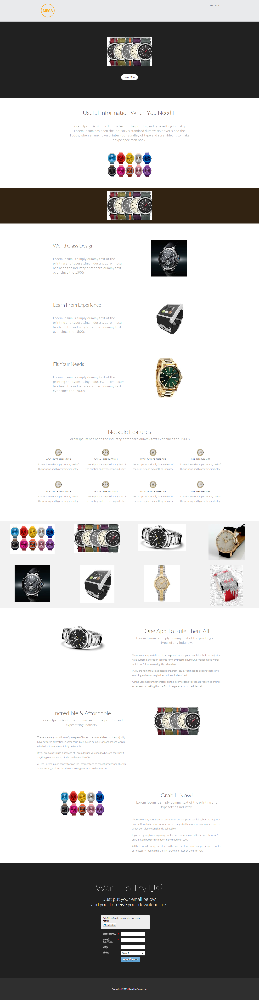

# Modèle 16-E {#template-e}

Cliquez avec le bouton droit pour [Télécharger le modèle 16-E](http://docs.marketo.com/download/attachments/9437846/template-16e.html?version=1&amp;modificationdate=1438980814000&amp;api=v2).

Ce modèle comprend le contenu suivant :

* En-tête (facultatif)
* Une section Principale

   * inclut une image à forte identification et un bouton En savoir plus

* Six sections de contenu (facultatif)
* Pied de page (facultatif)

Cliquez avec le bouton droit ci-dessous pour télécharger ce modèle :

[Template16-E.html](http://docs.marketo.com/download/attachments/9437846/template-16e.html?version=1&amp;modificationdate=1438980814000&amp;api=v2)
