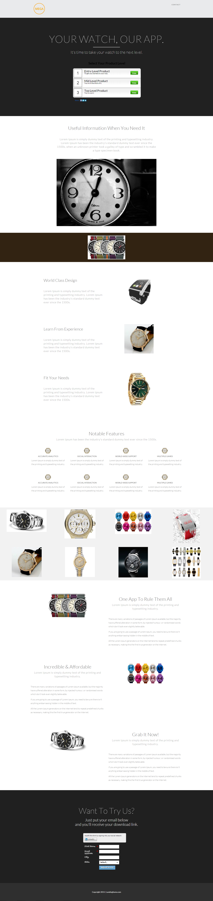

# Modèle 16C {#template-16c}

Cliquez avec le bouton droit pour [télécharger le modèle 16C](https://experienceleague.adobe.com/landing/marketo/lp-templates/template-16c.html?lang=fr)

Ce modèle comprend le contenu suivant :

* Un en-tête (facultatif)
* Une section principale

   * inclut le titre de la herbe et le questionnaire ;

* Six sections de contenu (facultatif)
* Pied de page (facultatif)

**Cliquez avec le bouton droit ci-dessous pour télécharger ce modèle :**

[Modèle 16C.html](https://experienceleague.adobe.com/landing/marketo/lp-templates/template-16c.html?lang=fr)
