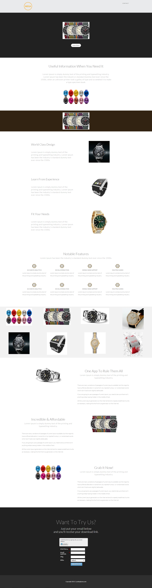

# Modèle 16-E {#template-16e}

Cliquez avec le bouton droit pour [télécharger le modèle 16-E](https://experienceleague.adobe.com/landing/marketo/lp-templates/template-16e.html)

Ce modèle comprend le contenu suivant :

* En-tête (facultatif)
* Une section principale

   * comprend une image de premier plan et un bouton En savoir plus .

* Six sections de corps (facultatif)
* Pied de page (facultatif)

**Cliquez avec le bouton droit de la souris ci-dessous pour télécharger ce modèle :**

[Modèle 16-E.html](https://experienceleague.adobe.com/landing/marketo/lp-templates/template-16e.html)
