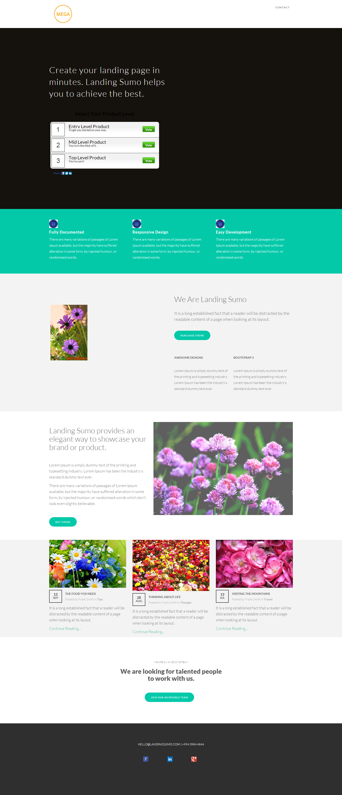

# Modèle 18-C {#template-c}

[Télécharger le modèle 18-C](https://docs.marketo.com/download/attachments/9438212/template-18c.html?version=1&amp;modificationdate=1439843246000&amp;api=v2)

Ce modèle comprend le contenu suivant :

* En-tête (facultatif)
* Une section Principale

   * inclut le texte et le sondage en héros

* Cinq sections de contenu (facultatif)
* Pied de page (facultatif)

**Cliquez ci-dessous pour télécharger ce modèle :**

[Template18-C.html](https://docs.marketo.com/download/attachments/9438212/template-18c.html?version=1&amp;modificationdate=1439843246000&amp;api=v2)
