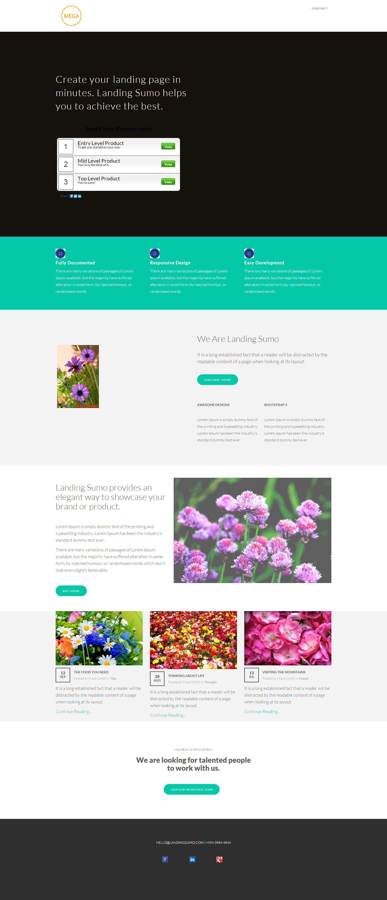

# Modèle 18C {#template-18c}

Cliquez avec le bouton droit pour [télécharger le modèle 18C](https://experienceleague.adobe.com/landing/marketo/lp-templates/template-18c.html)

Ce modèle comprend le contenu suivant :

* En-tête (facultatif)
* Une section principale

   * inclut un texte et un sondage de premier plan

* Cinq sections de corps (facultatif)
* Pied de page (facultatif)

**Cliquez avec le bouton droit de la souris ci-dessous pour télécharger ce modèle :**

[Modèle 18C.html](https://experienceleague.adobe.com/landing/marketo/lp-templates/template-18c.html)
