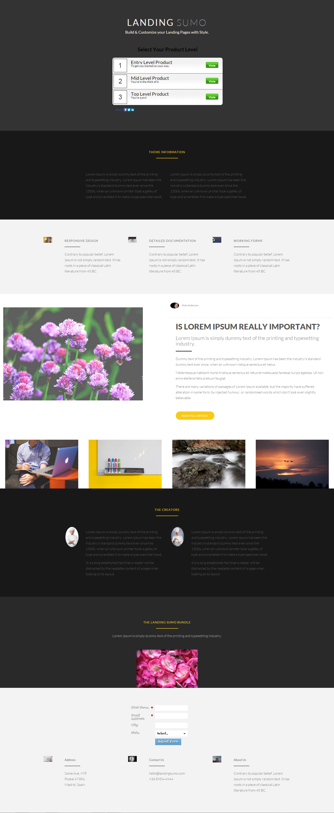

# Modèle 19C {#template-19c}

Cliquez avec le bouton droit pour [télécharger le modèle 19C](https://51837-micrositemarketo.adobeio-static.net/lp-templates/template-19c.html)

Ce modèle comprend le contenu suivant :

* Une section principale

  * inclut le titre, le texte et le sondage du héros

* Cinq sections de corps (facultatif)
* Pied de page (facultatif)

**Cliquez avec le bouton droit de la souris ci-dessous pour télécharger ce modèle :**

[Modèle 19C.html](https://51837-micrositemarketo.adobeio-static.net/lp-templates/template-19c.html)
