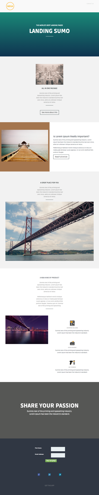

# Modèle 4A {#template-4a}

Cliquez avec le bouton droit pour [télécharger le modèle 4A](https://experienceleague.adobe.com/landing/marketo/lp-templates/template-4a.html)

Ce modèle comprend le contenu suivant :

* En-tête (facultatif)
* Une section principale

   * inclut le titre et le texte du héros.

* Cinq sections de corps (facultatif)
* Pied de page (facultatif)

**Cliquez avec le bouton droit de la souris ci-dessous pour télécharger ce modèle :**

[Modèle 4A.html](https://experienceleague.adobe.com/landing/marketo/lp-templates/template-4a.html)
