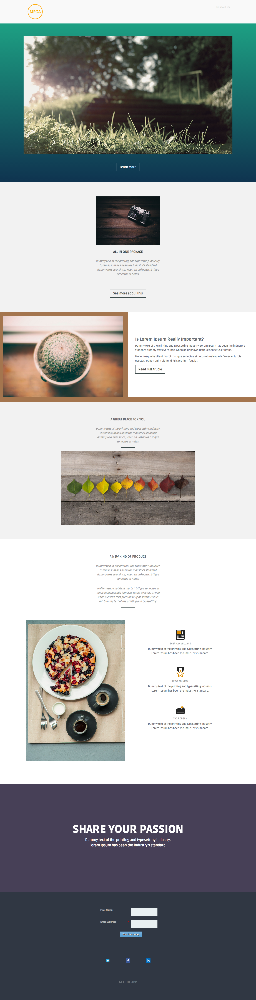

# Modèle 4B {#template-4b}

Cliquez avec le bouton droit pour [télécharger le modèle 4B](https://experienceleague.adobe.com/landing/marketo/lp-templates/template-4b.html)

Ce modèle comprend le contenu suivant :

* Une section d’en-tête (facultatif)
* Une section principale

   * comprend une image principale et un bouton CTA

* Cinq sections de corps (facultatif)
* Pied de page (facultatif)

**Cliquez avec le bouton droit de la souris ci-dessous pour télécharger ce modèle :**

[Modèle 4B.html](https://experienceleague.adobe.com/landing/marketo/lp-templates/template-4b.html)
