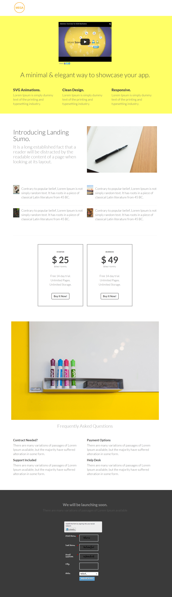

# Modèle 5B {#template-5b}

Cliquez avec le bouton droit pour [télécharger le modèle 5B](https://experienceleague.adobe.com/landing/marketo/lp-templates/template-5b.html)

Ce modèle comprend le contenu suivant :

* En-tête (facultatif)
* Une section principale

   * inclut le titre et le texte du héros.

* Cinq sections de corps (facultatif)
* Pied de page (facultatif)

**Cliquez avec le bouton droit de la souris ci-dessous pour télécharger ce modèle :**

[Modèle 5B.html](https://experienceleague.adobe.com/landing/marketo/lp-templates/template-5b.html)
