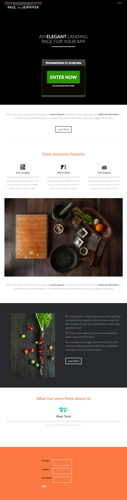

# Modèle 7E {#template-7e}

Cliquez avec le bouton droit pour [télécharger le modèle 7E](https://experienceleague.adobe.com/landing/marketo/lp-templates/template-7e.html)

Ce modèle comprend le contenu suivant :

* En-tête (facultatif)
* Une section principale

   * comprend un en-tête et un tirage au sort

* Quatre sections de corps (facultatif)
* Un pied de page (facultatif)

**Cliquez avec le bouton droit de la souris ci-dessous pour télécharger ce modèle :**

[Modèle 7E.html](https://experienceleague.adobe.com/landing/marketo/lp-templates/template-7e.html)
