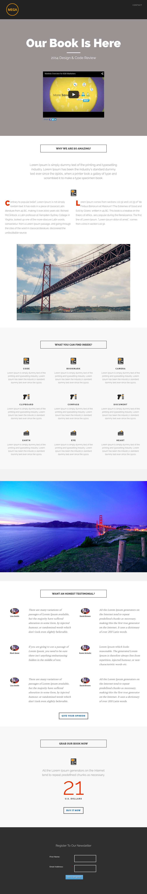

# Modèle 8-C {#template-c}

[Télécharger le modèle 8-C](http://docs.marketo.com/download/attachments/8783966/template-8c.html?version=1&amp;modificationdate=1482175053000&amp;api=v2)

Ce modèle comprend le contenu suivant :

* En-tête (facultatif)
* Une section Principale

   * inclut un en-tête de héros, un texte de héros et une vidéo

* Cinq sections de contenu (facultatif)
* Pied de page (facultatif)

Cliquez ci-dessous pour télécharger ce modèle :

[Template8-C.html](http://docs.marketo.com/download/attachments/8783966/template-8c.html?version=1&amp;modificationdate=1482175053000&amp;api=v2)
