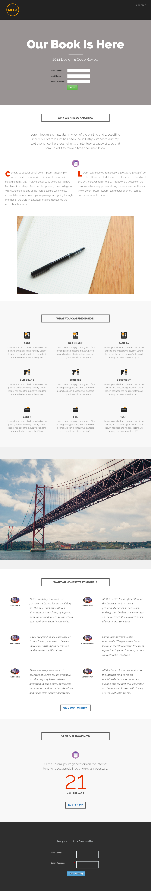

# Modèle 8-E {#template-e}

[Télécharger le modèle 8-E](http://docs.marketo.com/download/attachments/8783972/template-8e.html?version=1&amp;modificationdate=1482175134000&amp;api=v2)

Ce modèle comprend le contenu suivant :

* En-tête (facultatif)
* Une section Principale

   * inclut un en-tête de héros, un texte de héros et un formulaire.

* Cinq sections de contenu (facultatif)
* Pied de page (facultatif)

Cliquez ci-dessous pour télécharger ce modèle :

[Template8-E.html](http://docs.marketo.com/download/attachments/8783972/template-8e.html?version=1&amp;modificationdate=1482175134000&amp;api=v2)
