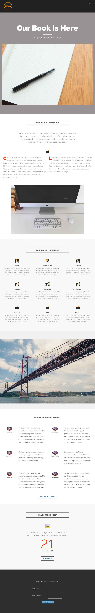

# Modèle 8B {#template-8b}

[Télécharger le modèle 8B](https://experienceleague.adobe.com/landing/marketo/lp-templates/template-8b.html)

Ce modèle comprend le contenu suivant :

* Un en-tête (facultatif)
* Une section Principale

   * inclut un en-tête de héros, une image de héros et un texte de héros ;

* Cinq sections de contenu (facultatif)
* Un pied de page (facultatif)

**Cliquez ci-dessous pour télécharger ce modèle :**

[Template 8B.html](https://experienceleague.adobe.com/landing/marketo/lp-templates/template-8b.html)
