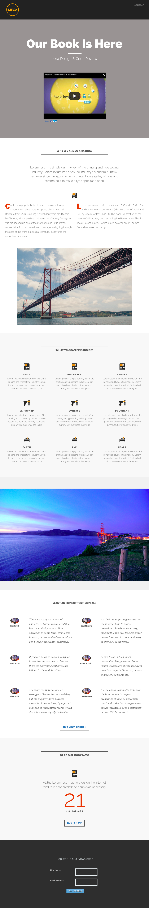

# Modèle 8C {#template-8c}

Cliquez avec le bouton droit pour [télécharger le modèle 8C](https://experienceleague.adobe.com/landing/marketo/lp-templates/template-8c.html)

Ce modèle comprend le contenu suivant :

* En-tête (facultatif)
* Une section principale

   * comprend un en-tête de héros, du texte de héros et une vidéo

* Cinq sections de corps (facultatif)
* Un pied de page (facultatif)

**Cliquez avec le bouton droit de la souris ci-dessous pour télécharger ce modèle :**

[Modèle 8C.html](https://experienceleague.adobe.com/landing/marketo/lp-templates/template-8c.html)
