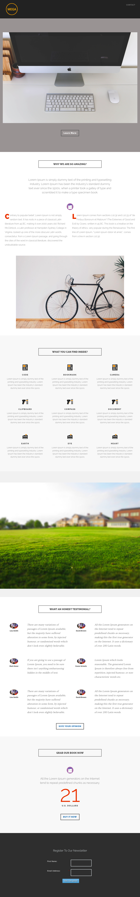

# Modèle 8G {#template-8g}

Cliquez avec le bouton droit pour [télécharger le modèle 8G](https://51837-micrositemarketo.adobeio-static.net/lp-templates/template-8g.html)

Ce modèle comprend le contenu suivant :

* En-tête (facultatif)
* Une section principale

  * comprend une image principale et un bouton

* Cinq sections de corps (facultatif)
* Un pied de page (facultatif)

**Cliquez avec le bouton droit de la souris ci-dessous pour télécharger ce modèle :**

[Modèle 8G.html](https://51837-micrositemarketo.adobeio-static.net/lp-templates/template-8g.html)
