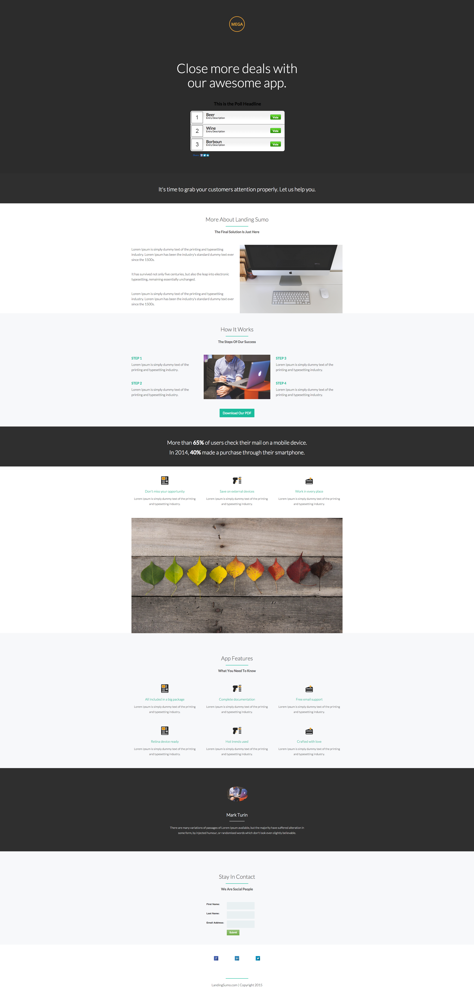

# Modèle 9D {#template-9d}

Cliquez avec le bouton droit sur [télécharger le modèle 9D](https://51837-micrositemarketo.adobeio-static.net/lp-templates/template-9d.html) et sélectionnez **Enregistrer le lien sous...**

>[!NOTE]
>
>Les étapes complètes de téléchargement et d’importation d’un modèle [sont disponibles ici](/help/marketo/product-docs/demand-generation/landing-pages/landing-page-templates/guided-landing-page-template-list.md#how-to-import){target="_blank"}.

Ce modèle comprend le contenu suivant :

* Une section principale

  * comprend une image de logo, un en-tête de héros et un sondage

* Huit sections du corps (facultatif)
* Un pied de page (facultatif)

**Cliquez avec le bouton droit ci-dessous (et sélectionnez _Enregistrer le lien sous..._) pour télécharger ce modèle, procédez comme suit**

[Modèle 9D.html](https://51837-micrositemarketo.adobeio-static.net/lp-templates/template-9d.html)
