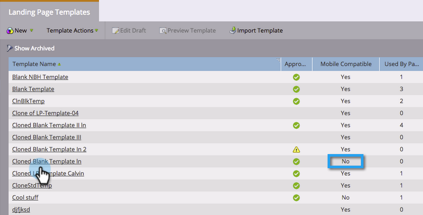
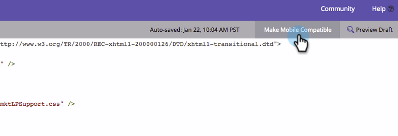

# Rendre un modèle de page d’entrée de forme libre existant compatible avec les périphériques mobiles {#make-an-existing-free-form-landing-page-template-mobile-compatible}

Vous pouvez le faire à deux endroits : l’éditeur de modèles et l’éditeur de page d’entrée.

## Mise à niveau à partir de l’éditeur de modèles {#upgrade-from-the-template-editor}

1. Accédez à **Design Studio**.

   

1. Sélectionnez **Modèles**.

   

1. Sélectionnez un modèle pour lequel **Mobile Compatible** est **Non**.

   

1. Cliquez sur **Modifier le brouillon**.

   

1. Cliquez sur **Rendre mobile compatible**.

   

1. Cliquez sur **Upgrade**.

   

   Votre modèle de landing page est désormais compatible avec les appareils mobiles.

   >[!NOTE]
   >
   >La mise à niveau doit être sans danger, mais assurez-vous de vérifier les incohérences des pages. La mise à niveau crée des brouillons de toutes les landing pages utilisant ce modèle.

   

## Qu’est-ce qui rend un modèle compatible avec Mobile ? {#what-makes-a-template-mobile-compatible}

Des questions formidables ! Votre modèle doit comporter les balises suivantes :

`<pre data-theme="Confluence">Must have <!DOCTYPE HTML> Must have a <HEAD> element Must have a <TITLE> in the <HEAD> element Must have <META CHARSET="UTF-8"> within the <HEAD> element Must have a <BODY> element that contains one (and only one) 

</pre>`

Si tout a l&#39;air bon, vous verrez ce message.

Si un problème se produit, un message d’erreur s’affiche, cliquez sur Réparer pour résoudre le problème et répétez le processus de validation.

Si vous apportez des modifications au modèle, cliquez sur Actions de modèle et sélectionnez Valider la compatibilité mobile.

## Mise à niveau d’un modèle à partir de l’éditeur de page d’entrée à structure libre {#upgrading-a-template-from-the-free-form-landing-page-editor}

Lorsque vous modifiez une landing page et que vous cliquez sur l&#39;onglet mobile, vous remarquerez parfois que le modèle n&#39;a pas été mis à niveau. N&#39;ayez pas peur ! Vous pouvez le mettre à niveau juste ici.

1. Cliquez sur l’onglet **Mobile** .

   

1. Cochez la case et cliquez sur **Activer**.

   

   >[!NOTE]
   >
   >L’activation de la version mobile d’un modèle crée des brouillons de toutes les landing pages qui l’utilisent.

Super ! Vous pouvez désormais [personnaliser la vue mobile](/help/marketo/product-docs/demand-generation/landing-pages/free-form-landing-pages/customize-mobile-view-for-your-free-form-landing-page.md) de toutes vos landing pages qui utilisent ce modèle.
