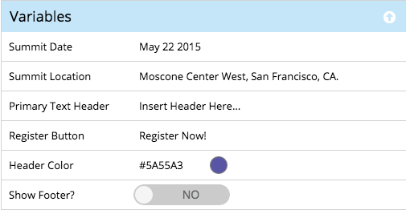

# Présentation des éléments et des variables dans les modèles guidés {#understanding-elements-and-variables-in-guided-templates}

Les modèles de landing page guidé présentent deux types de sections modifiables : éléments et variables.

## Eléments  {#elements}

Les éléments sont les différents éléments de contenu qui composent un landing page. Il peut s’agir d’images, de texte ou de ressources marketing.

Lorsque vous modifiez un landing page guidé, les éléments s’affichent s’ils ont été marqués comme modifiables dans le modèle. Les éléments auront les icônes suivantes :

*  Image
* Marketo
* Texte
* Vidéo
* Marketo Share
* Marketo
* Référence marketing
* Tirage Marketo
* d&#39;extrait de code Marketo

Variables

Les variables sont des attributs de type jeton qui peuvent être personnalisés à partir de l’éditeur de landing page guidé, comme illustré ci-dessous.

Il existe trois types de variables : variables de chaîne, variables de couleur et variables booléennes.

<table> 
 <tbody> 
  <tr> 
   <td>Chaîne</td> 
   <td>
Texte modifiable

Exemple : Titres, dates, libellés de bouton
</td> 
  </tr> 
  <tr> 
   <td>Couleur</td> 
   <td>
Code hexadécimal modifiable pour la couleur

Exemple : Couleur d’arrière-plan, couleur de police, couleur de bordure
</td> 
  </tr> 
  <tr> 
   <td>Boolean</td> 
   <td>
Un levier qui contrôle les états d'activation/désactivation des objets ou des formats sur le landing page

Exemples : Afficher le pied de page (Oui/Non), Nombre de colonnes (1/2), Incorporer les Google Analytics (True/False)
</td> 
  </tr> 
 </tbody> 
</table>

>[!MORELIKETHIS]
>
>[Création d’un modèle de Landing page guidé](create-a-guided-landing-page-template.md)

