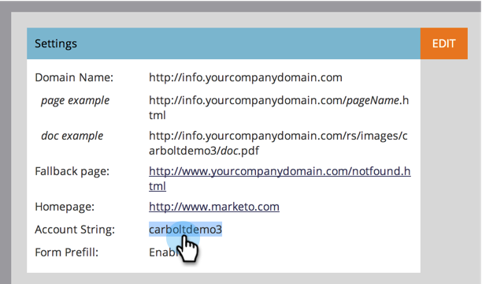

# Ajouter des CNAME de Landing page supplémentaires {#add-additional-landing-page-cnames}

Vous pouvez ajouter des CNAME de landing page pour permettre à différentes URL de pointer vers vos landings page de marketing. Suivez les étapes ci-dessous pour gérer plusieurs domaines.

>[!CAUTION]
>
>Les cookies ne peuvent pas être partagés entre les domaines.

>[!TIP]
>
>**Même domaine de niveau supérieur - Bon ! Les cookies sont shared.go**.mycompany.com > **info**.mycompany.com **Domaines de niveau supérieur différents - Mauvais ! Les cookies ne sont pas partagés.**
>allez-y.**mycompany**.com > go.**mynewcompany**.com

>[!NOTE]
>
>**Autorisations d’administrateur requises**

## Rechercher votre chaîne de compte {#find-your-account-string}

1. Accédez à la zone **Admin** et cliquez sur **Landings page**.

   

1. Copiez la **Chaîne du compte** de la section **Paramètres**.

   

1. Notez-en l’état pour l’étape suivante.

## Envoyer la demande au service informatique {#send-request-to-it}

1. Demandez à votre service informatique de configurer le CNAME suivant : (Remplacez le mot [CNAME] par le CNAME de votre choix et [CHAÎNE DE COMPTE] par le texte de l’étape précédente.)

   [CNAME].YourCompany.com >  [ACCOUNT STRING].mktoweb.com

## Ajouter un nouveau CNAME {#add-a-new-cname}

1. Une fois que votre service informatique a créé le CNAME, accédez à **Admin**, puis cliquez sur **Landings page**.

   

1. Cliquez sur **Nouveau**, puis sélectionnez **Nouvel alias de domaine**.

   

1. Entrez votre **alias de domaine.** La  **page** par défaut s’affiche si le visiteur ne place pas d’URL. Indiquez où ils doivent se rendre dans ce cas.

   >[!NOTE]
   >
   >Pour la page par défaut, vous pouvez sélectionner un landing page ou une URL externe, telle que votre site Web public.

   

1. Saisissez votre **Page par défaut** et cliquez sur **Créer**.

   

Sympa ! Maintenant, vous savez quoi faire si vous voulez ajouter un CNAME.
