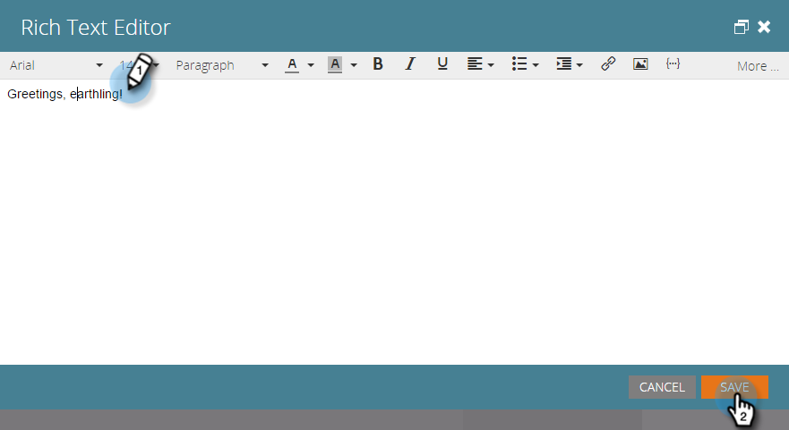
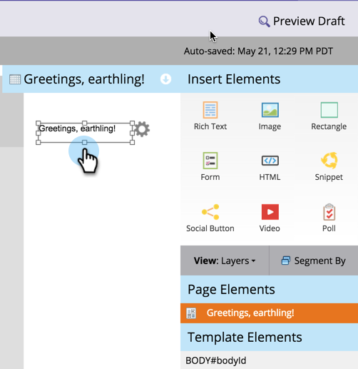
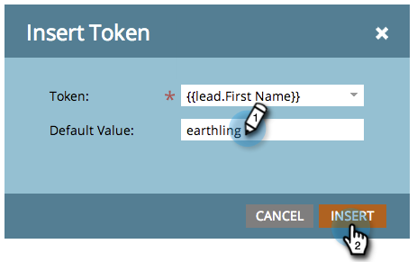

# Ajouter le texte et les jetons à un Landing page {#add-text-and-tokens-to-a-landing-page}

>[!NOTE]
>
>Les jetons ne sont pris en charge que dans les landings page Marketo.

## Ajouter du texte enrichi à votre Landing page {#add-rich-text-to-your-landing-page}

1. Sélectionnez votre landing page et cliquez sur **Modifier le brouillon**.

   

   >[!NOTE]
   >
   >Le concepteur de landing page s’ouvre dans une nouvelle fenêtre.

1. Faites glisser le curseur sur l’élément **Texte enrichi**.

   

1. Saisissez le texte de votre choix et cliquez sur **Enregistrer**.

   

Maintenant que vous savez comment ajouter du texte à un landing page, travaillons à l&#39;ajout d&#39;un jeton.

## Ajouter un jeton à votre Landing page {#add-a-token-to-your-landing-page}

Les jetons sont des bits dynamiques de texte qui peuvent personnaliser votre landing page.

>[!TIP]
>
>Des choses comme le prénom viennent de l&#39;enregistrement de la personne. D’autres jetons proviennent de l’onglet Mes jetons du programme.

1. Sélectionnez votre landing page et cliquez sur **Modifier le brouillon**.

   

   >[!NOTE]
   >
   >Le concepteur de landing page s’ouvre dans une nouvelle fenêtre.

1. Cliquez avec le doublon sur la zone de texte enrichi à laquelle vous souhaitez ajouter le jeton.

   

1. Cliquez sur l&#39;icône Insérer un jeton.

   

1. Recherchez et sélectionnez le jeton de votre choix.

   

1. Saisissez une **valeur par défaut** et cliquez sur **Insérer**.

   

1. Cliquez sur **Enregistrer**.

   

   Mission terminée ! Vous avez maintenant un jeton sur votre landing page.
