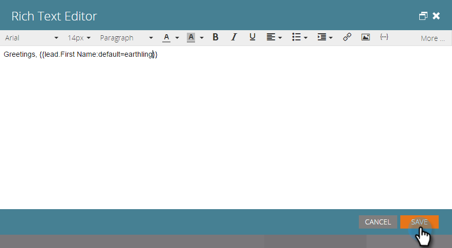

# Ajout de texte et de jetons à une page d’entrée {#add-text-and-tokens-to-a-landing-page}

>[!NOTE]
>
>Les jetons ne sont pris en charge que dans les landing pages Marketo.

## Ajout de texte enrichi à votre page d’entrée {#add-rich-text-to-your-landing-page}

1. Sélectionnez votre landing page et cliquez sur **Modifier le brouillon**.

   

   >[!NOTE]
   >
   >Le concepteur de landing page s’ouvre dans une nouvelle fenêtre.

1. Faites glisser le pointeur de la souris sur l’élément **Texte enrichi** .

   

1. Saisissez le texte de votre choix et cliquez sur **Enregistrer**.

   

Maintenant que vous savez comment ajouter du texte à une landing page, nous allons ajouter un jeton.

## Ajout d’un jeton à votre page d’entrée {#add-a-token-to-your-landing-page}

Les jetons sont des blocs de texte dynamiques qui peuvent personnaliser votre landing page.

>[!TIP]
>
>Des choses comme Prénom viennent de l’enregistrement de la personne. D’autres jetons proviennent de l’onglet Mes jetons du programme.

1. Sélectionnez votre landing page et cliquez sur **Modifier le brouillon**.

   

   >[!NOTE]
   >
   >Le concepteur de landing page s’ouvre dans une nouvelle fenêtre.

1. Double-cliquez sur la zone de texte enrichi à laquelle vous souhaitez ajouter le jeton.

   

1. Cliquez sur l’icône Insérer un jeton .

   

1. Recherchez et sélectionnez le jeton de votre choix.

   

1. Saisissez une **valeur par défaut** et cliquez sur **Insérer**.

   

1. Cliquez sur **Enregistrer**.

   

   Mission terminée ! Votre page d’entrée contient maintenant un jeton.
