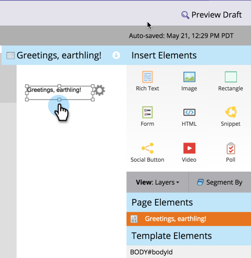

# Ajouter du texte et des jetons à une page de destination {#add-text-and-tokens-to-a-landing-page}

>[!NOTE]
>
>Les jetons ne sont pris en charge que dans les pages de destination Marketo.

## Ajouter du texte enrichi à votre page de destination {#add-rich-text-to-your-landing-page}

1. Sélectionnez votre page de destination et cliquez sur **[!UICONTROL Modifier le brouillon]**.

   

   >[!NOTE]
   >
   >Le concepteur de page de destination s’ouvre dans une nouvelle fenêtre.

1. Faites glisser sur l’élément **[!UICONTROL Texte enrichi]**.

   

1. Saisissez le texte souhaité, puis cliquez sur **[!UICONTROL Enregistrer]**.

   

Maintenant que vous savez comment ajouter du texte à une page de destination, la section suivante traite de l’ajout d’un jeton.

## Ajouter un jeton à votre page de destination {#add-a-token-to-your-landing-page}

Les jetons sont des éléments textuels dynamiques qui peuvent personnaliser votre page de destination.

>[!TIP]
>
>Les valeurs telles que Prénom proviennent de l’enregistrement de la personne. Les autres jetons proviennent de l’onglet Mes jetons dans le programme.

1. Sélectionnez votre page de destination et cliquez sur **[!UICONTROL Modifier le brouillon]**.

   

   >[!NOTE]
   >
   >Le concepteur de page de destination s’ouvre dans une nouvelle fenêtre.

1. Double-cliquez sur la zone de texte enrichi à laquelle vous souhaitez ajouter le jeton.

   

1. Cliquez sur l’icône Insérer un jeton .

   

1. Recherchez et sélectionnez le jeton de votre choix.

   

1. Saisissez une **[!UICONTROL Valeur par défaut]** puis cliquez sur **[!UICONTROL Insérer]**.

   

1. Cliquez sur **[!UICONTROL Enregistrer]**

   

   Vous disposez désormais d’un jeton sur votre page de destination.
