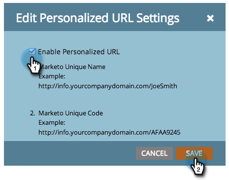

# Activer les URL personnalisées pour une page de destination {#enable-personalized-urls-for-a-landing-page}

Les URL personnalisées sont idéales pour les campagnes par courrier imprimé.

>[!PREREQUISITES]
>
>[Activer les URL personnalisées pour votre compte](/help/marketo/product-docs/demand-generation/landing-pages/personalizing-landing-pages/enable-personalized-urls-for-your-account.md)

1. Sélectionnez une page de destination et cliquez sur les paramètres d’**[!UICONTROL URL personnalisée]**.

   

1. Vous pouvez maintenant cocher **[!UICONTROL Activer l’URL personnalisée]** et cliquer sur **[!UICONTROL Enregistrer]**.

   

Fantastique ! Vous avez maintenant activé les URL personnalisées pour votre page de destination. Les visiteurs qui utilisent cette URL seront reconnus et les jetons fonctionneront correctement.
