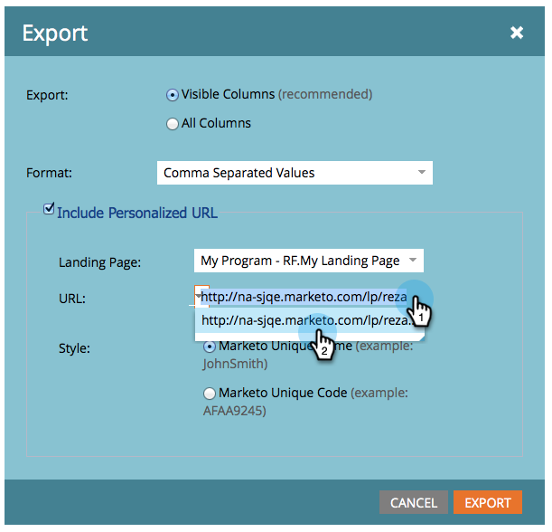

# Exporter une liste avec des URL personnalisées {#export-a-list-with-personalized-urls}

>[!PREREQUISITES]
>
>* [Activer les URL personnalisées pour votre compte](/help/marketo/product-docs/demand-generation/landing-pages/personalizing-landing-pages/enable-personalized-urls-for-your-account.md)
>* [Activer des URL personnalisées pour une page de destination](/help/marketo/product-docs/demand-generation/landing-pages/personalizing-landing-pages/enable-personalized-urls-for-a-landing-page.md)

1. Sélectionnez votre liste ou votre liste dynamique, cliquez sur l’onglet **[!UICONTROL Leads]** pour obtenir les résultats, puis cliquez sur l’icône Excel. INLINE Vérifiez que vous avez **[!UICONTROL Code unique Marketo]** et **[!UICONTROL Nom unique Marketo]** [colonnes visibles](/help/marketo/product-docs/core-marketo-concepts/smart-lists-and-static-lists/using-smart-lists/create-and-change-views-for-lists-and-smart-list.md).

   

1. Cochez la case **[!UICONTROL Inclure une URL personnalisée]**, puis recherchez et sélectionnez la page de destination pour laquelle vous souhaitez générer des URL.

   

1. Sélectionnez l’**URL**.

   

   >[!TIP]
   >
   >Si plusieurs URL s’affichent pour la même page de destination, cela est probablement dû au fait que vous avez modifié l’URL des pages à un moment donné dans le passé et créé une redirection.

1. Choisissez un **[!UICONTROL Style]**, puis cliquez sur **[!UICONTROL Exporter]**.

   

1. Une fois l’exportation terminée, cliquez sur le lien **[!UICONTROL Télécharger maintenant]** pour enregistrer le fichier.

   

   Et c&#39;est fini ! Vous disposez désormais d’une liste de prospects et d’URL personnalisées.

   

   >[!NOTE]
   >
   >Si des prospects portent le même prénom et le même nom, des numéros seront ajoutés automatiquement pour s’assurer que les URL restent uniques.
