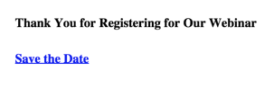

# Inclure un fichier ICS Événement de calendrier dans un Landing page {#include-a-calendar-event-ics-file-in-a-landing-page}

Un jeton **Fichier de calendrier** vous permet d’ajouter un lien de événement de calendrier (.ics) à vos landings page de marketing.

>[!PREREQUISITES]
>
>* [Créer un fichier de Événement de calendrier (.ics)](/help/marketo/product-docs/email-marketing/general/functions-in-the-editor/create-a-calendar-event-ics-file.md)

1. Dans l’éditeur de landing page, cliquez sur **{...}** pour insérer un jeton.

   

1. Sélectionnez le jeton **Fichier de calendrier** et cliquez sur **Insérer**.

   >[!CAUTION]
   >
   >Les jetons suivants ne sont pas pris en charge sur les landings page :
   >
   >* URL du membre.webinar

   

1. Cliquez sur **Enregistrer**.

   Les gens verront un landing page qui ressemble à ceci :

   

Doux ! Tout devrait marcher bien maintenant. Assurez-vous de tester.

>[!MORELIKETHIS]
>
>[Inclure un Événement de calendrier (.ics) dans un courriel](/help/marketo/product-docs/email-marketing/general/functions-in-the-editor/include-a-calendar-event-ics-in-an-email.md)
