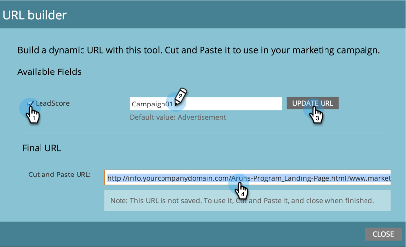

# Utiliser le Générateur d’URL {#using-the-url-builder}

Le créateur d’URL vous aide à créer des URL qui peuvent remplir des champs de formulaire masqués Marketo.

>[!PREREQUISITES]
>
>Découvrez comment créer des champs masqués dans les formulaires et modifier leurs paramètres dans [Définir un champ de formulaire comme masqué](/help/marketo/product-docs/demand-generation/forms/form-fields/set-a-form-field-as-hidden.md).

1. Sélectionnez une page de destination, cliquez sur **[!UICONTROL Actions de la page de destination]**, survolez **[!UICONTROL Outils d’URL]**, puis cliquez sur **[!UICONTROL Créateur d’URL]**.

   

1. Sélectionnez le ou les champs à utiliser, saisissez la valeur, puis cliquez sur **[!UICONTROL Mettre à jour l’URL]**.

   

   >[!NOTE]
   >
   >Si vous ne voyez aucun champ disponible dans le créateur, assurez-vous que votre formulaire comporte des champs masqués et qu’ils sont [définis pour accepter les paramètres d’URL](/help/marketo/product-docs/demand-generation/forms/form-fields/set-a-hidden-form-field-value.md#url-parameter).

Bon travail ! Vous pouvez maintenant copier et coller l’URL et l’utiliser sur le web.
