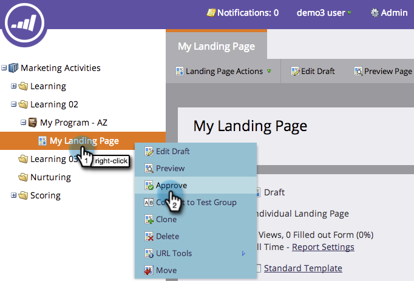
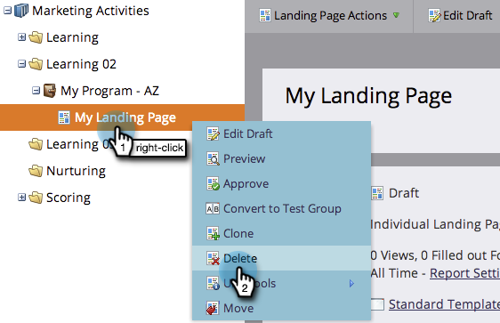

# Approbation, désapprobation ou suppression d’un Landing page {#approve-unapprove-or-delete-a-landing-page}

Les landings page sont en mode brouillon jusqu’à ce que vous les approuviez. L’approbation rend les pages disponibles dans le reste du système. Lorsque vous modifiez un landing page approuvé, Marketo enregistre le brouillon, mais continue à utiliser la version approuvée jusqu’à ce que vous approuviez le brouillon.

## Approuver un Landing page {#approve-a-landing-page}

1. Sélectionnez un landing page, accédez à Actions **** Landing page et cliquez sur **Approuver**.

   >[!TIP]
   >
   >Vous pouvez [approuver plusieurs pages à la fois](../../../../product-docs/demand-generation/landing-pages/landing-page-actions/approve-multiple-landing-pages-at-once.md) pour simplifier votre vie.

   

1. Vous pouvez également cliquer avec le bouton droit de la souris sur votre landing page et cliquer sur **Approuver**.

   

   >[!NOTE]
   >
   >**Rappel**
   >
   >
   >Une fois approuvée, l’icône de votre landing page comporte une coche verte.

1. Désapprobation d’un Landing page
1. Sélectionnez un landing page, accédez à Actions **** Landing page et cliquez sur **Désapprouver**.

   

1. Vous pouvez également cliquer avec le bouton droit de la souris sur votre landing page et cliquer sur **Désapprouver**.

   

>[!NOTE]
>
>Votre landing page non approuvé n’est plus publié sur le Web et ne générera aucune activité supplémentaire. Les visiteurs aux landings page non approuvés et à leurs onglets Facebook verront la page [de](../../../../product-docs/administration/settings/set-a-fallback-page.md)secours.

## Suppression d’un Landing page {#delete-a-landing-page}

1. Sélectionnez un landing page, accédez à Actions **** Landing page et cliquez sur **Supprimer**.

   

   >[!NOTE]
   >
   >Vous ne pouvez pas supprimer un landing page approuvé. Désapprouvez-le d&#39;abord.

1. Vous pouvez également cliquer avec le bouton droit de la souris sur votre landing page et cliquer sur **Supprimer**.

   

## Supprimer plusieurs Landings page {#delete-multiple-landing-pages}

Souhaitez-vous supprimer plusieurs landings page à la fois ? Voici comment.

1. Dans Design Studio, cliquez sur **Landings page**.

   

1. Cliquez sur le premier landing page à supprimer, puis cliquez sur le dernier tout en maintenant la touche Maj enfoncée.

   

   >[!TIP]
   >
   >Vous pouvez également utiliser la touche Ctrl+clic pour supprimer plusieurs landings page qui ne sont pas séquentiels.

1. Cliquez sur la liste déroulante Actions **** Landing page et sélectionnez **Supprimer**.

   

1. Cliquez sur **Supprimer**.

   

Super ! Vous savez maintenant comment approuver, désapprouver et supprimer des landings page.
