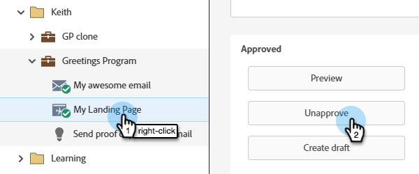

# Approuver, annuler l’approbation ou supprimer une page de destination {#approve-unapprove-or-delete-a-landing-page}

Les landing pages sont en mode brouillon jusqu’à ce que vous les approuviez. L’approbation rend les pages disponibles dans le reste du système. Lorsque vous modifiez une page de destination approuvée, Marketo Engage enregistre le brouillon, mais continue à utiliser la version approuvée jusqu’à ce que vous approuviez le brouillon.

## Approuver une page de destination {#approve-a-landing-page}

1. Sélectionnez la page de destination souhaitée, puis cliquez sur **[!UICONTROL Approuver le brouillon]**.

   

   >[!TIP]
   >
   >Vous pouvez [approuver plusieurs pages à la fois](/help/marketo/product-docs/demand-generation/landing-pages/landing-page-actions/approve-multiple-landing-pages-at-once.md) si vous le souhaitez.

Vous pouvez également cliquer avec le bouton droit de la souris sur votre page de destination dans le volet de navigation de gauche, puis sélectionner **[!UICONTROL Approuver]**.

>[!NOTE]
>
>Une page de destination approuvée est marquée d’une coche verte.

## Désapprobation d’une page de destination {#unapprove-a-landing-page}

1. Sélectionnez la page de destination souhaitée et cliquez sur **[!UICONTROL Désapprouver]**.

   

Vous pouvez également cliquer avec le bouton droit de la souris sur votre page de destination dans le volet de navigation de gauche, puis sélectionner **[!UICONTROL Désapprouver]**.

>[!NOTE]
>
>Votre page de destination non approuvée n’est plus publiée sur le web et ne générera aucune activité supplémentaire. Les visiteurs qui accèdent à des pages de destination non approuvées et à leurs onglets Facebook voient la [page de secours](/help/marketo/product-docs/administration/settings/set-a-fallback-page.md).

## Suppression d’une page de destination {#delete-a-landing-page}

1. Sélectionnez la page de destination souhaitée. Cliquez sur le menu déroulant **[!UICONTROL Actions de la page de destination]** et sélectionnez **[!UICONTROL Supprimer]**.

   

   >[!IMPORTANT]
   >
   >Vous ne pouvez pas supprimer une page de destination approuvée. Vous devez d&#39;abord le désapprouver.

Vous pouvez également cliquer avec le bouton droit de la souris sur votre page de destination dans le volet de navigation de gauche, puis sélectionner **[!UICONTROL Supprimer]**.

## Supprimer plusieurs pages de destination {#delete-multiple-landing-pages}

1. Sur l’écran principal [!UICONTROL Design Studio], cliquez sur **[!UICONTROL Pages de destination]**.

   

1. Sélectionnez les pages de destination de votre choix. Cliquez sur le menu déroulant **[!UICONTROL Actions de la page de destination]** et sélectionnez **[!UICONTROL Supprimer]**.

   

1. Cliquez sur **[!UICONTROL Supprimer]** pour confirmer.

   
