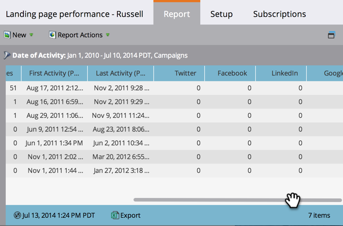

# Rapport sur les performances des pages de destination {#landing-page-performance-report}

Découvrez combien de personnes ont rempli les formulaires dans vos pages de destination et combien d’entre elles étaient nouvelles.

>[!NOTE]
>
>Si vous constatez une incohérence dans les nombres entre votre liste dynamique et votre rapport de performances de page de destination, c’est probablement parce que les listes dynamiques filtrent uniquement les données sur les personnes, tandis que les rapports de performances de page de destination incluent les activités sociales (Facebook, Google Ads, etc.) et anonymes, en plus des données sur les personnes.

1. [Créez un rapport](/help/marketo/product-docs/reporting/basic-reporting/creating-reports/create-a-report-in-a-program.md) puis sélectionnez le [!UICONTROL Performances de la page de destination] [type de rapport](/help/marketo/product-docs/reporting/basic-reporting/report-types/report-type-overview.md).
1. [Définissez la période de votre rapport](/help/marketo/product-docs/reporting/basic-reporting/editing-reports/change-a-report-time-frame.md) puis cliquez sur l’onglet [!UICONTROL Rapport].
1. Vous avez terminé. Explorez votre rapport pour évaluer la performance de vos pages de destination.

   

   Parmi les colonnes d’un rapport de performances sur les pages de destination, les colonnes Conversions et % de conversion reflètent le nombre de fois qu’une personne a rempli un formulaire.

   >[!TIP]
   >
   >Recherchez les pages avec le pourcentage de conversion le plus élevé. [Triez votre rapport](/help/marketo/product-docs/reporting/basic-reporting/editing-reports/sort-report-on-columns.md) sur cette colonne et choisissez Trier par ordre décroissant.

   L’icône AB du rapport indique que les statistiques représentent le total de toutes les pages de ce [groupe de test de la page de destination](/help/marketo/product-docs/demand-generation/landing-pages/understanding-landing-pages/landing-page-test-groups.md).

1. Faites défiler la page vers la droite pour afficher le nombre de visites provenant de différentes plateformes de médias sociaux.

   

>[!MORELIKETHIS]
>
>[Filtrez le rapport de performances de votre page de destination](/help/marketo/product-docs/demand-generation/landing-pages/landing-page-actions/filter-a-landing-page-performance-report.md) par ressources locales ou globales.
