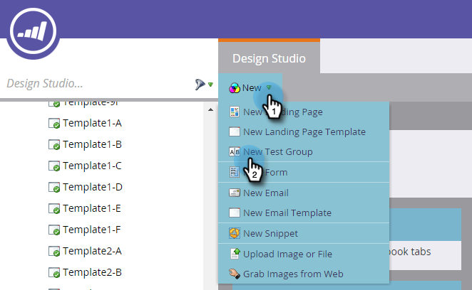
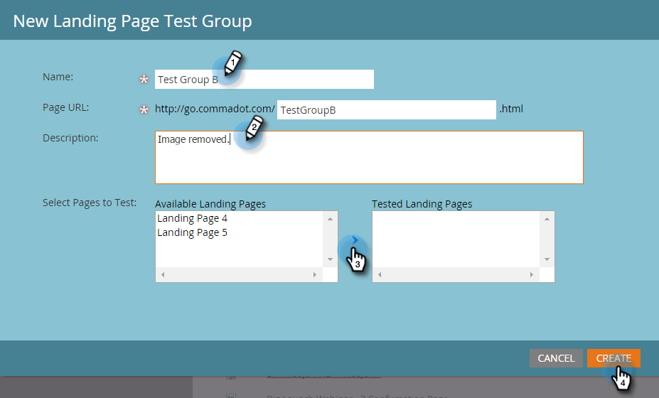

# Groupes de tests de landing page {#landing-page-test-groups}

Marketo effectue le suivi du nombre de vues de page et de remplissage de formulaires sur chaque page testée dans un groupe de tests. Vous pouvez utiliser les résultats des groupes de tests pour déterminer le Landing page le plus convaincant. Voici comment créer un groupe de tests.

>[!NOTE]
>
>**Conditions préalables**
>
>[Créez au moins deux landings page](../../../../getting-started/quick-wins/landing-page-with-a-form.md), de préférence avec un formulaire.

1. Dans Design Studio, cliquez sur **Nouveau**. Dans la liste déroulante, sélectionnez **Nouveau groupe** de tests.

   

   >[!NOTE]
   >
   >Les autres méthodes pour créer un groupe de test sont les suivantes :
   >
   >    
   >    
   >    * Cliquez avec le bouton droit de la souris sur un landing page dans l&#39;arborescence et sélectionnez **Convertir en groupe de tests.**
   >    * Créez un groupe de test de Landing page dans un programme en choisissant Groupe **de test** AB dans le menu **Nouveau fichier** local.

1. Entrez un nom et une description facultative. Sélectionnez les Landings page à tester, puis cliquez sur **Créer**.

   

   >[!NOTE]
   >
   >Seuls les Landings page non approuvés seront disponibles pour le choix.

1. Cliquez avec le bouton droit sur chaque Landing page et sélectionnez **Approuver**.

   

1. Cliquez sur la liste déroulante Options **du groupe de** tests et sélectionnez **Approuver le groupe** de tests.

   

   C&#39;est tout ! Vous pourrez désormais comparer les statistiques de vos Landings page sélectionnés.

   

   >[!TIP]
   >
   >Si vous souhaitez supprimer le groupe de test, il vous suffit de cliquer sur Actions **du groupe de** test et de sélectionner **Supprimer le groupe** de test.

