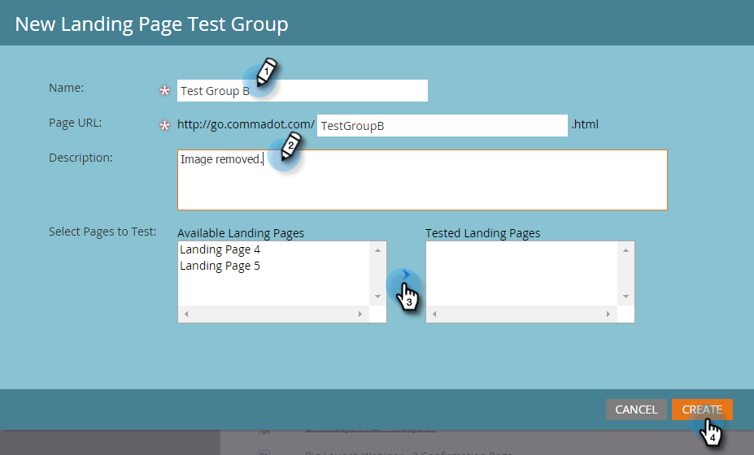

# Groupes de test de page de destination {#landing-page-test-groups}

Marketo effectue le suivi du nombre de pages vues et de formulaires remplis sur chaque page testée au sein d’un groupe de test. Vous pouvez utiliser les résultats du groupe de tests pour déterminer la page de destination la plus attrayante. Voici comment créer un groupe de test.

>[!PREREQUISITES]
>
>[Créez plusieurs pages de destination](/help/marketo/getting-started/quick-wins/landing-page-with-a-form.md) de préférence avec un formulaire.

1. Dans Design Studio, cliquez sur **[!UICONTROL Nouveau]**. Dans la liste déroulante, sélectionnez **[!UICONTROL Nouveau groupe de test]**.

   

   >[!NOTE]
   >
   >Les autres méthodes de création d&#39;un groupe de test sont les suivantes :
   >
   >* Cliquez avec le bouton droit de la souris sur une page de destination dans l’arborescence, puis sélectionnez **[!UICONTROL Convertir en groupe de test]**
   >* Créez un groupe de tests de page de destination dans un programme en choisissant **[!UICONTROL Groupe de tests AB]** dans le menu **[!UICONTROL Nouvelle ressource locale]**

1. Saisissez un nom et une description facultative. Sélectionnez les pages de destination à tester, puis cliquez sur **[!UICONTROL Créer]**.

   

   >[!NOTE]
   >
   >Seules les pages de destination non approuvées peuvent être sélectionnées.

1. Cliquez avec le bouton droit sur chaque page de destination et sélectionnez **[!UICONTROL Approuver]**.

   

1. Cliquez sur le menu déroulant **[!UICONTROL Actions du groupe de test]** et sélectionnez **[!UICONTROL Approuver le groupe de test]**.

   

   Vous pouvez maintenant comparer les statistiques des pages de destination sélectionnées.

   

   >[!TIP]
   >
   >Si vous souhaitez supprimer le groupe de test, cliquez sur **[!UICONTROL Actions du groupe de test]** et sélectionnez **[!UICONTROL Supprimer le groupe de test]**.
