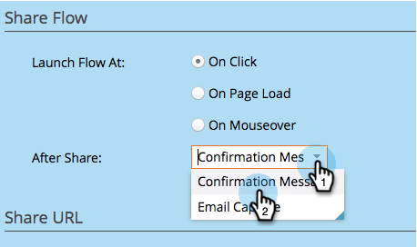
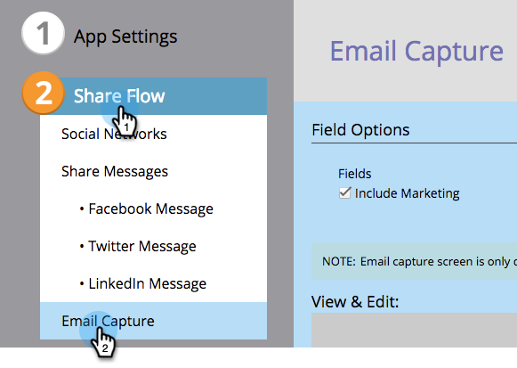
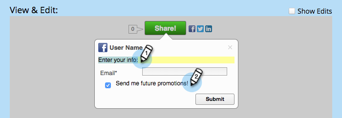

# Configurer les invites après le partage {#configure-after-share-prompts}

Dans les applications de bouton social, de partage de vidéos et de sondage, vous pouvez choisir ce qui se passe lorsqu’une personne partage votre contenu sur son réseau social.

1. Accédez à **Activités marketing**.

   

1. Sélectionnez l’application, puis cliquez sur **Modifier le brouillon**.

   

1. Dans l’éditeur d’applications sociales, accédez à **Paramètres de l’application*********, puis à **Options avancées**.

   

1. Pour **Après le partage**, sélectionnez le comportement souhaité.

   

   * **Message de confirmation :** Une fois que la personne a partagé, affichez une confirmation.
   * **Capture de l’e-mail :** une fois que la personne a partagé, demandez son adresse e-mail.

   >[!NOTE]
   >
   >Si vous sélectionnez **Capture de courrier électronique**, la demande n’est affichée que si la personne n’a pas déjà fourni ses informations.

1. Si vous choisissez **Message de confirmation :** Accédez à **Partager le flux**, puis **Message de confirmation**.

   

1. Modifiez le message de confirmation.

   

1. Si vous avez choisi **Capture du courriel** (au lieu de la confirmation) : Accédez à **Flux de partage**, puis **Capture de courrier électronique**.

   

1. Indiquez si vous souhaitez inclure une invite marketing et si cette case à cocher est sélectionnée par défaut (**Opt-out**) ou non (**Opt-in**).

   

1. Modifiez l’adresse électronique de la demande et l’invite marketing (si vous l’avez incluse).

   

