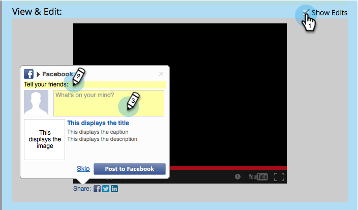

# Configuration du flux recommandé par Social {#configure-social-recommend-flow}

Lorsque vous créez une application sociale, vous pouvez configurer les choix de réseaux sociaux et les invites qu’un utilisateur rencontre lors de son inscription.

## Sélectionner des réseaux pour le partage {#select-networks-for-sharing}

>[!NOTE]
>
>Il s’agit d’un processus très similaire à [la configuration du flux d’inscription/partage sur les réseaux sociaux](/help/marketo/product-docs/demand-generation/social/configuring-social-actions/configure-social-sign-up-share-flow.md), mais il s’agit des liens de partage _sous_ l’application sociale.

1. Accédez à **Activités marketing**.

   

1. Sélectionnez l’application, puis cliquez sur **Modifier le brouillon**.

   

1. Dans l’éditeur d’applications sociales, accédez à **Flux recommandé** > **Réseaux sociaux**.

   

1. Sélectionnez les réseaux vers lesquels un utilisateur peut partager.

   

## Configuration du message Facebook {#configure-the-facebook-message}

1. Configurez le message qui apparaîtra dans les publications Facebook.

   

   >[!NOTE]
   >
   >Dans un partage de vidéo, la miniature est générée automatiquement.

   Si vous choisissez **Ajouter le contenu dynamique**, les valeurs des balises OpenGraph de la page (og:title, og:caption et og:description) et de la miniature sont automatiquement ajoutées aux publications Facebook. Voir l’étape suivante.

   Si vous choisissez **Ajouter le contenu statique**, saisissez le titre, la légende et la description, puis téléchargez une image. Consultez les deux étapes suivantes.

1. Dans la fenêtre Vue et modification, cliquez sur **Afficher les modifications** pour personnaliser l’invite et le message de partage qui apparaîtront dans les publications Facebook.

   >[!TIP]
   >
   >Pour plus d’informations, voir [Modifier les paramètres de publication enrichie Facebook](/help/marketo/product-docs/demand-generation/facebook/edit-facebook-rich-post-settings.md).

   

   >[!NOTE]
   >
   >L&#39;[URL de partage](/help/marketo/product-docs/demand-generation/social/social-functions/choose-the-share-url-for-a-social-app.md) est automatiquement ajouté à tous les messages de partage.

1. Si vous avez choisi **Ajouter le contenu statique** ci-dessus, modifiez le titre, la légende et la description, puis téléchargez une image personnalisée (à partir de vos images et fichiers marketing).

   

   Voir [Ajouter des images et des fichiers sur Marketo](/help/marketo/product-docs/demand-generation/images-and-files/add-images-and-files-to-marketo.md).

   >[!NOTE]
   >
   >Si vous téléchargez une image, elle ne s’affichera pas ici tant que vous n’aurez pas fermé et rouvert l’éditeur d’applications sociales.

1. Cliquez sur **Suivant**.

Si vous choisissez , les valeurs des balises OpenGraph de la page (og:title, og:caption et og:description) et de la vignette sont automatiquement ajoutées aux publications Facebook. Voir l’étape suivante.

## Configuration du message Twitter {#configure-the-twitter-message}

1. Cliquez sur pour modifier l’invite et le message de partage qui apparaîtront dans les tweets Twitter.

   

   >[!TIP]
   >
   >Utilisez {html_title} dans votre texte de tweet pour afficher automatiquement le titre de la page.

1. Cliquez sur **Suivant**.

## Configuration du message LinkedIn {#configure-the-linkedin-message}

1. Configurez le message qui apparaîtra dans les publications LinkedIn.

   

   Si vous choisissez **Ajouter le contenu dynamique**, les valeurs des balises de pages (titre et description) et la miniature sont automatiquement ajoutées aux publications LinkedIn. Voir l’étape suivante.

   Si vous choisissez **Ajouter le contenu statique**, saisissez le titre, la légende et la description, puis téléchargez une image. Consultez les deux étapes suivantes.

1. Dans la fenêtre **Vue et modification**, cliquez sur **Afficher les modifications** et modifiez l’invite et le message de partage qui apparaîtront dans les publications LinkedIn.

   

   >[!TIP]
   >
   >Utilisez {html_title} dans votre texte de publication pour afficher automatiquement le titre de la page.

1. Si vous avez choisi **Ajouter le contenu statique** ci-dessus, modifiez le titre et la description, puis téléchargez une image personnalisée (à partir de vos images et fichiers marketing).

   

   Voir [Ajouter des images et des fichiers sur Marketo](/help/marketo/product-docs/demand-generation/images-and-files/add-images-and-files-to-marketo.md).

   >[!NOTE]
   >
   >Si vous téléchargez une image, elle ne s’affichera pas ici tant que vous n’aurez pas fermé et rouvert l’éditeur d’applications sociales.

1. Cliquez sur **Suivant**.

## Configurer le message de confirmation {#configure-the-confirmation-message}

1. Modifiez le texte de la confirmation du partage.

   

1. Cliquez sur **Terminer** > **Approuver** et **Fermer**.

   

>[!MORELIKETHIS]
>
>L’étape suivante consiste à [ajouter votre partage de vidéo](/help/marketo/product-docs/demand-generation/social/configuring-social-actions/customize-video-share-flow.md) ou [sondage](/help/marketo/product-docs/demand-generation/social/creating-a-poll/create-a-poll.md) à un landing page, à Facebook ou à votre propre site Web.
