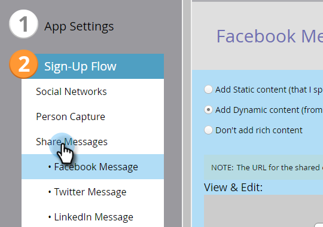

# Configuration du flux d’inscription/de partage sur les réseaux sociaux {#configure-social-sign-up-share-flow}

Lorsque vous créez une application sociale, vous pouvez configurer les choix de réseau social et les invites qu’un utilisateur rencontre lors de son inscription.

## Sélectionner des réseaux pour le partage {#select-networks-for-sharing}

1. Accédez à Activités **** marketing.

   

1. Sélectionnez l’application, puis cliquez sur **Modifier le brouillon****.**

   

1. Dans l’éditeur d’applications sociales, cliquez sur Flux **d’** abonnement > Réseaux **** sociaux**.**

   

1. Sélectionnez (ou désélectionnez) les réseaux vers lesquels une personne peut partager.

   

## Configuration du message Facebook {#configure-the-facebook-message}

1. Accédez à **Abonnement** **Flux** > **Partager** **les messages.**

   

1. Configurez le message qui apparaîtra dans les publications Facebook.

   

   >[!NOTE]
   >
   >Dans un partage de vidéo, la miniature est générée automatiquement.

   **Ajouter le contenu dynamique,***** OpenGraphSi vous choisissez **Ajouter le contenu statique,** saisissez le titre, la légende, la description et téléchargez une image. Consultez les deux étapes suivantes.

1. Dans la fenêtre Vue et modification, cliquez sur **Afficher les modifications** et modifiez l’invite et le message de partage qui apparaîtront dans les publications Facebook.

   >[!TIP]
   >
   >Pour plus d’informations, voir [Modification des paramètres](../../../../product-docs/demand-generation/facebook/edit-facebook-rich-post-settings.md)de publication enrichie Facebook.

   

   >[!NOTE]
   >
   >L’URL [de](../../../../product-docs/demand-generation/social/social-functions/choose-the-share-url-for-a-social-app.md) partage est automatiquement ajoutée à tous les messages de partage.

1. Si vous avez choisi **Ajouter le** contenu **statique** ci-dessus, modifiez le titre, la légende et la description, puis téléchargez une image personnalisée (à partir de vos images [**** Marketo **et de Files).******](../../../../product-docs/demand-generation/images-and-files/add-images-and-files-to-marketo.md)****

   

   Voir [Ajouter des images et des fichiers au marketing](../../../../product-docs/demand-generation/images-and-files/add-images-and-files-to-marketo.md).

   >[!NOTE]
   >
   >Si vous téléchargez une image, elle ne s’affichera pas ici tant que vous n’aurez pas fermé et rouvert l’éditeur d’applications sociales.

1. Cliquez sur **Suivant**.

Si vous choisissez les valeurs des balises de la page (og:title, og:caption et og:description) et la miniature sont automatiquement ajoutées aux publications Facebook. Voir l’étape suivante.

## Configuration du message Twitter {#configure-the-twitter-message}

1. Modifiez l’invite de partage et le message qui apparaîtront dans les tweets Twitter.

   

   >[!TIP]
   >
   >Utilisez {html_title} dans votre texte de tweet pour afficher automatiquement le titre de la page.

1. Cliquez sur **Suivant**.

## Configuration du message LinkedIn {#configure-the-linkedin-message}

1. Configurez le message qui apparaîtra dans les publications LinkedIn.

   

   Si vous choisissez **Ajouter le** contenu **dynamique**, les valeurs des balises de page (titre et description) et la miniature sont automatiquement ajoutées aux publications LinkedIn. Voir l’étape suivante.

   Si vous choisissez **Ajouter du contenu statique,** saisissez le titre, la légende et la description, puis téléchargez une image. Consultez les deux étapes suivantes.

1. Dans la fenêtre **Vue** **&amp;** **Modifier** , cliquez sur **Afficher les modifications et modifiez l’invite de partage et le message qui apparaîtront dans les publications LinkedIn.**

   

   >[!TIP]
   >
   >Utilisez {html_title} dans votre texte de publication pour afficher automatiquement le titre de la page.

1. Si vous avez choisi **Ajouter le** contenu **statique** ci-dessus, modifiez le titre et la description, puis téléchargez une image personnalisée (à partir de vos images [**** Marketo **et Files).******](../../../../product-docs/demand-generation/images-and-files/add-images-and-files-to-marketo.md)

   

>[!NOTE]
>
>Si vous téléchargez une image, elle ne s’affichera pas ici tant que vous n’aurez pas fermé et rouvert l’éditeur d’applications sociales.

>[!NOTE]
>
>**Articles connexes**
>
>Ensuite, vous pouvez cliquer sur **Terminer > Approuver et fermer** et placer votre application sociale sur un landing page. Vous pouvez également configurer la capture [de](configure-person-capture-for-a-social-app.md) personnes ou l’invite [de](configure-re-share-email-and-prompt-for-a-social-app.md)partage à nouveau.

